# FinAgent: AI Personal Finance Assistant

**EECS3311 Fall 2026, Course Project Stage 1: Project Design Report**

**Author:** [Your Name], [Student #] (solo project)
**Repository:** [GitHub URL]

---

## Table of Contents

1. [Project Overview](#1-project-overview)
2. [Feature Specifications](#2-feature-specifications)
3. [UML Class Diagram](#3-uml-class-diagram)
4. [Design Pattern Explanations](#4-design-pattern-explanations)
5. [Use-Case Diagram](#5-use-case-diagram)
6. [Use-Case Descriptions](#6-use-case-descriptions)
7. [Sequence Diagrams](#7-sequence-diagrams)
8. [Feature-to-Design Traceability Table](#8-feature-to-design-traceability-table)
9. [Feature Implementation Explanations](#9-feature-implementation-explanations)
10. [Stage 2 Implementation Plan](#10-stage-2-implementation-plan)

---

## 1. Project Overview

### 1.1 Problem and Motivation

Most people's financial data lives in CSV exports from their bank that nobody reads. Typical budgeting apps can draw a pie chart, but they cannot answer the questions people actually have:

- "Why did I go over budget in March?"
- "Which subscriptions am I still paying for?"
- "Can I save $2,000 by April, and what would I have to cut?"

Answering these questions takes several steps. You have to pull the right transactions, aggregate them, compare periods, and explain the result in plain language. That is too tedious to do by hand and too open-ended for a fixed set of reports.

FinAgent solves this by combining a conventional, deterministic finance tracker with an AI agent that can reason over the user's data through a controlled set of tools.

### 1.2 Target Users

- **University students and young professionals** who want to understand where their money goes without manually sorting hundreds of transactions.
- **People managing a tight budget** who need early warnings before overspending.
- **Users saving toward a goal**, such as tuition, a trip, or an emergency fund, who want a concrete plan.

### 1.3 What the Agent Can Do

- **Categorize** imported transactions, learning from the user's own corrections.
- **Detect** recurring payments and decide which ones are subscriptions.
- **Flag** unusual expenses and explain, in plain language, why each one stands out.
- **Answer** natural-language questions about the user's finances. To do this, it plans which data it needs, calls query tools, and reasons over the results across multiple steps.
- **Write** a monthly summary with personalized saving suggestions.
- **Build** a savings plan for a goal by investigating the user's spending and proposing specific cuts.

### 1.4 Why an AI Agent Is Appropriate

A question like "How much more did I spend on food this month compared to last month, and why?" cannot be answered by a single prompt. The model does not have the data, and the data is too large to paste into every request.

The agent therefore has to work in steps:

1. Interpret the question and decide what information is needed.
2. Call `CompareMonthsTool` for the two months.
3. Possibly call `QueryTransactionsTool` to see which merchants drove the difference.
4. Combine the results into an explanation.

This plan → act → observe → answer loop is genuine agent behaviour: reasoning, tool use, multi-step execution, and conversational memory. Two other areas also benefit from an LLM:

- **Categorization** of messy merchant strings like `SQ *BLUE BTL 0423`.
- **Explanations** of statistical findings.

Rigid rules handle both of these poorly.

At the same time, everything that must be exact stays deterministic: totals, budget percentages, recurring-payment detection, and anomaly scoring. The LLM never does arithmetic on money and never reads the database directly.

### 1.5 AI/LLM Models

| Model | Used for | Why |
|---|---|---|
| **Claude Sonnet** (Anthropic Messages API) | Agent Q&A (F09), saving plans (F11), monthly summaries (F10), anomaly explanations (F08) | Strong reasoning and native tool-use support |
| **Claude Haiku** (Anthropic Messages API) | Bulk transaction categorization (F02), subscription labelling (F07) | Fast and cheap for high-volume, short, structured tasks |
| **MockLlmClient** (scripted) | Unit tests and offline demos | Deterministic responses, no API key needed |

All models sit behind the `LLMClient` interface (Adapter pattern). Another provider, such as OpenAI, Gemini, or a local Ollama model, could be added by writing one new adapter class, with no changes to the agent or services.

**API access and cost.** The application calls the Anthropic Messages API, which is billed per token and is separate from any Claude app subscription. The team will use a small prepaid API credit with a spending limit set in the Claude Console. To keep costs low and builds deterministic, all services and agent logic are developed and unit-tested against `MockLlmClient`. The real API is used only for integration testing and the final demo. If no API key is configured, the app still runs: categorization falls back to rules only, and AI features show an "assistant offline" message.

### 1.6 How the AI Interacts with the Rest of the System

The LLM is isolated behind two boundaries:

1. **`LLMClient` interface.** All model calls go through it. The rest of the system works with `LlmRequest`/`LlmResponse` objects and never sees SDK or HTTP details.
2. **Tool boundary (`ToolRegistry` + `AgentTool`).** The LLM cannot touch the database. It is shown a list of tool specifications, such as name, description, and JSON input schema. When it wants data, it returns a *tool call*. `FinanceAgent` executes the matching Java tool, which calls the real service, and sends the JSON result back to the model. This repeats until the model produces a final answer, or until `maxSteps` (6) is reached.

**Agent loop (F09, F11):**

```
user question
   → FinanceAgent builds request (system prompt + memory + tool specs)
   → LLM responds with either:
        (a) tool call(s) → ToolRegistry.execute() → result appended → loop again
        (b) final text   → returned to GUI/CLI as AgentResponse
```

**Single-shot structured calls (F02, F07, F08, F10).** The deterministic layer computes the facts first. The LLM is then asked for a structured JSON response that labels or explains those facts. Responses are validated before use, and invalid output falls back to deterministic behaviour.

All AI output is shown as informational. FinAgent displays a notice that it does not provide professional financial advice.

### 1.7 Overall Architecture

FinAgent uses a layered architecture with MVC in the GUI and a single Facade shared by the GUI and the CLI.

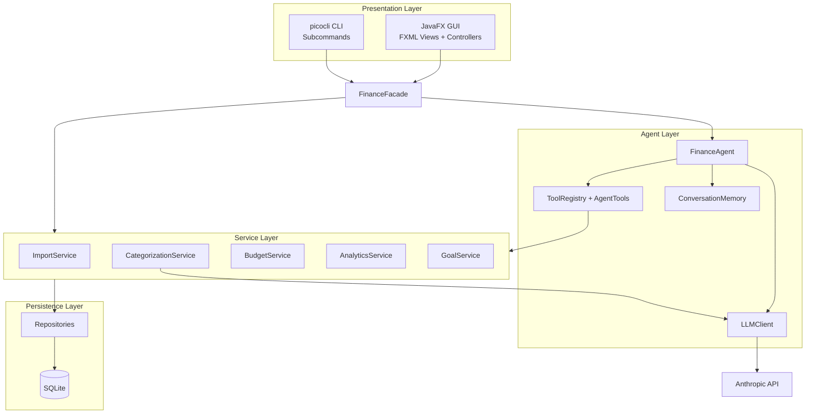

| Layer | Responsibility |
|---|---|
| Presentation | JavaFX views/controllers (GUI) and picocli subcommands (CLI). No business logic. |
| Facade | `FinanceFacade`: one entry point for every feature, used identically by GUI and CLI. |
| Services | Deterministic business logic: import, categorization, budgets, analytics, goals. |
| Agent | `FinanceAgent`, tools, memory, prompt construction, LLM adapters. |
| Persistence | Repository classes over a local SQLite database. |

### 1.8 User Interfaces

**GUI (JavaFX).** The main window has a left navigation bar and four tabs:

- **Dashboard:** this month's totals, budget alerts banner, and the AI monthly summary.
- **Transactions:** an import button and an editable table with category and source columns. Low-confidence rows are highlighted.
- **Budgets & Goals:** budget editor with progress bars, plus savings goals, contributions, and AI saving plans.
- **Insights:** trends charts, recurring payments, and unusual expenses.

An **Ask FinAgent** chat panel is docked on the right side of every tab.

**CLI (picocli).** Every major feature is also available from the terminal:

| Command | Features |
|---|---|
| `finagent import <file> --bank TD\|RBC\|GENERIC` | F01, F02 |
| `finagent category auto` | F02 |
| `finagent category set <txId> <category> [--remember]` | F03 |
| `finagent budget set <category> <amount> --month 2026-10` | F04 |
| `finagent budget copy --from 2026-09 --to 2026-10` | F04 |
| `finagent budget status --month 2026-10` | F05 |
| `finagent insights trends --from 2026-05 --to 2026-10` | F06 |
| `finagent insights recurring` | F07 |
| `finagent insights anomalies --month 2026-10` | F08 |
| `finagent ask "How much did I spend on dining in September?"` | F09 |
| `finagent summary --month 2026-10` | F10 |
| `finagent goal create\|contribute\|plan ...` | F11 |

Budget alerts (F05) print directly to the terminal when a CLI command crosses a threshold.

### 1.9 Technology Stack

| Concern | Choice |
|---|---|
| Language | Java 21 |
| GUI | JavaFX 21 with FXML |
| CLI | picocli |
| Storage | SQLite via JDBC |
| CSV parsing | OpenCSV |
| LLM | Anthropic Java SDK (Claude Sonnet, Claude Haiku) |
| JSON | Jackson |
| Testing | JUnit 5, Mockito, `MockLlmClient` |
| Build | Maven |

### 1.10 Scope for a Solo Project

FinAgent is built by one developer, so the scope is set to be fully deliverable in Stages 2 and 3:

- **11 features**, one above the required 10, as a buffer in case a feature is judged too small.
- **4 GUI tabs** instead of one screen per feature. Related features share a tab, which keeps the JavaFX work manageable.
- **Most features are deterministic Java.** The hard AI work is concentrated in one reusable agent loop (`FinanceAgent.runLoop()`), shared by F09 and F11.
- **No external services besides the LLM.** All data comes from local CSV files and SQLite, so there are no extra APIs to integrate or pay for.

---

## 2. Feature Specifications

FinAgent has **11 features**. Login, settings, and other trivial operations are not counted.

| ID | Feature | Type |
|---|---|---|
| F01 | Import Transactions | Deterministic |
| F02 | AI Auto-Categorization | Hybrid |
| F03 | Category Correction and Learning | Hybrid |
| F04 | Budget Management | Deterministic |
| F05 | Budget Tracking and Alerts | Deterministic |
| F06 | Spending Trends and Charts | Deterministic |
| F07 | Recurring Payment and Subscription Detection | Hybrid |
| F08 | Unusual Expense Detection | Hybrid |
| F09 | Natural-Language Financial Queries | AI (agent) |
| F10 | Monthly Summary Generation | Hybrid |
| F11 | Savings Goals and AI Saving Plan | Hybrid |

---

### F01: Import Transactions

**Description.** Imports a bank CSV export and converts it into FinAgent's standard `Transaction` format. Each bank uses different columns, date formats, and sign conventions, and all of them are normalized into one model. Duplicate rows from overlapping exports are skipped.

**User interaction.**
- **GUI:** Transactions tab → **Import CSV** → file chooser → select the bank format (TD, RBC, or Generic). For Generic, a column-mapping dialog asks which columns hold the date, description, and amount.
- **CLI:** `finagent import <file> --bank TD`

**Input.** CSV file path, bank format, and a column mapping (Generic only).

**Output.** New transactions saved to the database and the table refreshed. An import summary shows the number imported, duplicates skipped, and rows rejected with reasons.

**AI involvement.** Deterministic. Imported transactions are then passed to F02.

**Expected workflow.**
1. `ImporterFactory` creates the importer for the chosen bank format.
2. The importer's template method reads the rows, validates the header, maps each row to a `Transaction`, and normalizes merchant names and amount signs.
3. Each transaction is checked against existing records. A duplicate has the same date, amount, and description.
4. New transactions are categorized (F02) and saved.
5. Budgets for every affected month are recalculated (F05).

**Error/alternative cases.**
- **File missing or unreadable:** show an error and keep the dialog open.
- **Header does not match the selected bank:** reject the file and suggest the Generic importer.
- **Malformed rows** (bad date, non-numeric amount): skip those rows and list them by line number in the summary.
- **Every row is a duplicate:** report "No new transactions found."
- **Empty file:** show an error.

---

### F02: AI Auto-Categorization

**Description.** Assigns a spending category to each transaction, such as Groceries, Dining, Transport, or Subscriptions.

Saved rules handle known merchants instantly. The LLM categorizes the rest, guided by the user's past corrections as examples. Every category records its source (`RULE`, `AI`, or `USER`) and a confidence score.

**User interaction.**
- **GUI:** runs automatically after import. An **Auto-Categorize** button re-runs it on uncategorized rows. Low-confidence rows are highlighted yellow with a "Needs review" badge.
- **CLI:** `finagent category auto`

**Input.** Uncategorized transactions, saved `CategoryRule`s, and the allowed category list.

**Output.** Transactions updated with category, source, and confidence. A count is shown of how many were categorized by rule, by AI, and how many need review.

**AI involvement.** Hybrid. Rules run first, and the LLM (Claude Haiku) handles unmatched transactions.

**Expected workflow.**
1. `HybridStrategy` applies `RuleBasedStrategy` to every transaction.
2. Unmatched transactions are batched (up to 50 per request) and sent to `LlmStrategy`. The prompt includes the allowed categories, the user's correction rules as few-shot examples, and a strict JSON response format.
3. The JSON response is parsed and validated.
4. Results with confidence below 0.6 stay `UNCATEGORIZED` and are flagged for review.
5. Updated transactions are saved.

**Error/alternative cases.**
- **No API key or no network:** the service switches to `RuleBasedStrategy` only, and the GUI shows "AI categorization unavailable, rules only."
- **Invalid JSON from the LLM:** retry once, then leave the batch uncategorized.
- **LLM returns a category that is not in the allowed list:** reject that result.
- **Transactions the user categorized manually (`USER` source):** never overwritten.

---

### F03: Category Correction and Learning

**Description.** Lets the user fix a wrong category. If the user chooses "remember," the fix becomes a `CategoryRule`. The rule is applied immediately to matching transactions and to all future imports, and it is fed to the LLM as an example. The system improves from user feedback over time.

**User interaction.**
- **GUI:** double-click the category cell → choose a new category → optionally tick **"Always categorize [merchant] as [category]"**.
- **CLI:** `finagent category set <txId> <category> --remember`

**Input.** Transaction ID, new category, and the remember flag.

**Output.** The updated transaction, now with `USER` source. Optionally, a new rule plus a count of other transactions that were updated. Budget progress is refreshed.

**AI involvement.** Hybrid. The correction itself is deterministic, but saved rules become examples in the categorization prompt and shape future AI decisions.

**Expected workflow.**
1. The transaction is loaded and updated with source `USER`.
2. If remember is set, a `CategoryRule` (merchant pattern → category) is saved.
3. The rule is applied to existing transactions from that merchant with `AI` or `UNCATEGORIZED` source.
4. The budget for the transaction's month is recalculated, which can trigger F05 alerts.

**Error/alternative cases.**
- **Transaction not found:** show an error.
- **A rule for that merchant already exists with a different category:** ask whether to overwrite it.
- **User cancels the dialog:** nothing changes.

---

### F04: Budget Management

**Description.** Creates, edits, and deletes monthly spending limits per category, and copies last month's budgets into a new month.

**User interaction.**
- **GUI:** Budgets & Goals tab → choose the month → **Add Budget** (category dropdown and amount field) → **Save**. Edit or delete from the budget list. **Copy from previous month** fills in a new month.
- **CLI:** `finagent budget set Dining 300 --month 2026-10` and `finagent budget copy --from 2026-09 --to 2026-10`

**Input.** Month, category, and limit amount. For copy, the source and target months.

**Output.** Saved budgets and an updated budget list with progress for the month.

**AI involvement.** Deterministic.

**Expected workflow.**
1. Input is validated.
2. If a budget already exists for that category and month, it is updated. Otherwise a new one is created.
3. Budgets are recalculated against the month's transactions (F05).
4. The view refreshes.

**Error/alternative cases.**
- **Limit is zero, negative, or non-numeric:** show an inline validation error.
- **Duplicate category for the month:** confirm before replacing it.
- **Copy from a month with no budgets:** show "No budgets found for [month]."

---

### F05: Budget Tracking and Alerts

**Description.** Tracks spending against each budget and raises alerts at two levels: **WARNING** at 80% and **EXCEEDED** at 100%. Alerts are pushed to every registered listener (GUI banner, CLI output, alert history) as soon as a change in transactions or budgets crosses a threshold. Alert messages use fixed templates, such as "Dining budget at 85%," so no LLM call is needed and tracking stays fast.

**User interaction.**
- **GUI:** progress bars on the Budgets & Goals tab (green, amber, red), an alert banner on the Dashboard, and an alert-history list.
- **CLI:** `finagent budget status --month 2026-10`. Alerts are also printed during any command that triggers them.

**Input.** The month's budgets and transactions. No direct input is needed, since tracking is triggered automatically.

**Output.** A `BudgetStatus` per category with spent, remaining, and percentage used. `BudgetAlert` events are saved to the alert history.

**AI involvement.** Deterministic.

**Expected workflow.**
1. After any import, correction, or budget change, `BudgetService.recalculate(month)` runs.
2. It sums spending per category and compares the total with the limit.
3. If a budget reaches a higher alert level than the last one notified, a `BudgetAlert` is created and sent to all `BudgetAlertListener`s.

**Error/alternative cases.**
- **Category has spending but no budget:** shown as "No budget set," with no alert.
- **The same level was already alerted:** it is not repeated, which prevents spam.
- **A refund lowers spending below a threshold:** the status updates silently and the level resets.

---

### F06: Spending Trends and Charts

**Description.** Visualizes spending over a date range. It shows a pie chart of category share, a stacked bar chart of monthly spending per category, and a month-over-month comparison table with percentage change.

**User interaction.**
- **GUI:** Insights tab → **Trends** → pick From/To months → **Show**.
- **CLI:** `finagent insights trends --from 2026-05 --to 2026-10`, which prints a text table.

**Input.** Start month and end month.

**Output.** A `TrendReport` rendered as JavaFX charts (GUI) or a formatted table (CLI).

**AI involvement.** Deterministic.

**Expected workflow.**
1. Fetch transactions in the range.
2. Group them by month and category, excluding income.
3. Compute totals and percentage changes.
4. Build the `TrendReport` and render it.

**Error/alternative cases.**
- **From is after To:** show a validation error.
- **No transactions in the range:** show an empty state with an "Import transactions" link.
- **Range longer than 24 months:** cap it and inform the user.

---

### F07: Recurring Payment and Subscription Detection

**Description.** Finds charges that repeat on a regular schedule, then uses the LLM to label which ones are subscriptions (streaming, software, gym) versus essential bills (rent, phone) and to give each a readable name. The total monthly cost of subscriptions is shown.

**User interaction.**
- **GUI:** Insights tab → **Recurring** → **Scan**.
- **CLI:** `finagent insights recurring`

**Input.** The last 6 months of transactions.

**Output.** A list of `RecurringPayment`s with merchant, readable name, average amount, frequency, next expected date, and subscription flag. Also shown: total monthly subscription cost.

**AI involvement.** Hybrid. Detection is deterministic, and labelling uses the LLM (Claude Haiku).

**Expected workflow.**
1. `AnalyticsService` groups transactions by normalized merchant.
2. Merchants with 3 or more charges, a regular interval, and amounts varying by no more than 15% become candidates. A regular interval means weekly (6 to 8 days), monthly (27 to 33 days), or yearly (360 to 370 days).
3. `FinanceAgent.labelSubscriptions()` sends the candidates to the LLM and receives a JSON label for each.
4. The results are displayed.

**Error/alternative cases.**
- **Less than 3 months of data:** warn that results may be incomplete.
- **LLM unavailable:** show candidates as "Unlabeled," with frequency and amount still available.
- **No recurring charges found:** show a message saying so.

---

### F08: Unusual Expense Detection

**Description.** Flags transactions that are unusually large compared with the user's normal behaviour for that category. The LLM then explains each flag in plain language, for example: "This $640 at Best Buy is about 4× your typical Shopping purchase and is your largest expense this month."

**User interaction.**
- **GUI:** Insights tab → **Unusual Expenses** → choose month → **Scan**.
- **CLI:** `finagent insights anomalies --month 2026-10`

**Input.** Target month, plus the previous 3 months as a baseline.

**Output.** A list of `Anomaly` objects, each with the transaction, the statistical reason, and an AI explanation.

**AI involvement.** Hybrid. Statistical detection is deterministic, and the explanations come from the LLM (Claude Sonnet).

**Expected workflow.**
1. Compute the per-category mean, standard deviation, and median from the baseline months.
2. Flag a transaction if any of these is true:
   - the amount is more than the mean plus 2.5 standard deviations;
   - the amount is more than 3× the category median;
   - the merchant is new and the amount is over $200.
3. If anything is flagged, `FinanceAgent.explainAnomalies()` sends the flagged items with their baseline numbers to the LLM.
4. The explanations are attached and the list is displayed.

**Error/alternative cases.**
- **Less than 2 months of history:** use only the new-merchant rule and show a notice.
- **No anomalies:** show "Nothing unusual this month."
- **LLM failure:** show the statistical reason instead, such as "3.4× category median."

---

### F09: Natural-Language Financial Queries

**Description.** The core agent feature. The user asks any question about their finances in plain English. The agent plans which data it needs, calls tools to retrieve and compute it, and answers using real numbers.

Example questions:
- "Did I spend more on dining this month than last?"
- "What were my 5 biggest purchases in September?"
- "Am I on track with my budgets?"

Conversation memory supports follow-ups such as "What about August?"

**User interaction.**
- **GUI:** type in the **Ask FinAgent** chat panel and press Enter. Each answer has an expandable **"How I got this"** section listing the tools the agent called.
- **CLI:** `finagent ask "<question>"`

**Input.** A natural-language question, plus recent conversation history.

**Output.** An `AgentResponse` containing the answer text, the tool calls made, and the number of reasoning steps.

**AI involvement.** AI (agent), using Claude Sonnet with tool use.

**Available tools:**

| Tool | What it returns |
|---|---|
| `QueryTransactionsTool` | Transactions matching filters (date range, category, merchant, min/max amount, sort, limit) |
| `SpendingByCategoryTool` | Category totals for a month |
| `CompareMonthsTool` | Per-category differences between two months |
| `BudgetStatusTool` | Budget progress for a month |
| `RecurringPaymentsTool` | Detected recurring payments |
| `GoalsTool` | Savings goals and their progress |

**Expected workflow.**
1. The question is added to `ConversationMemory`.
2. `FinanceAgent` sends the system prompt, history, and tool specifications to the LLM.
3. The LLM either calls tools or answers.
4. Tool calls are executed through `ToolRegistry`, and the results are appended to the conversation.
5. Steps 2 to 4 repeat until a final answer is produced or 6 steps are reached.
6. The answer is saved to memory and displayed.

**Error/alternative cases.**
- **Question outside personal finance, or asking for investment advice:** the agent politely declines and repeats the informational-use notice.
- **Ambiguous question** (no clear time period): the agent asks a clarifying question.
- **Tool fails or receives invalid arguments:** an error result is returned to the LLM, which can retry or explain.
- **Six steps reached:** return a partial answer marked as incomplete.
- **API unavailable:** show "FinAgent's assistant is offline. Other features still work."

---

### F10: Monthly Summary Generation

**Description.** Produces a readable recap of a month. Exact statistics are computed deterministically: income, spending, top categories, budget results, and change from the previous month. The LLM then turns them into a short narrative with three personalized saving suggestions.

**User interaction.**
- **GUI:** Dashboard → choose month → **Generate Summary**.
- **CLI:** `finagent summary --month 2026-10`

**Input.** The target month.

**Output.** A `MonthlySummary` containing the `MonthlyStats` (numbers) and a 150 to 250 word narrative with suggestions.

**AI involvement.** Hybrid. The statistics are computed deterministically, and the narrative and suggestions come from Claude Sonnet, grounded in those statistics.

**Expected workflow.**
1. `AnalyticsService.getMonthlyStats()` computes the figures, and `BudgetService` adds the budget statuses.
2. `FinanceAgent.writeMonthlySummary()` sends only these computed figures to the LLM. The prompt instructs it to use only the numbers provided.
3. The narrative is combined with the stats and displayed.

**Error/alternative cases.**
- **No transactions for the month:** show an error.
- **LLM failure:** show a stats-only summary with the note "AI summary unavailable."

---

### F11: Savings Goals and AI Saving Plan

**Description.** The user creates savings goals (name, target amount, deadline) and logs contributions. On request, the agent investigates the user's recent spending through its tools and proposes a plan. The plan includes the required monthly saving amount, 3 to 5 specific spending cuts with estimated savings, and a feasibility verdict.

**User interaction.**
- **GUI:** Budgets & Goals tab → **New Goal** → enter details → progress bar appears. **Add Contribution** updates progress. **Get AI Plan** shows the plan in a side panel.
- **CLI:** `finagent goal create "Trip" 2000 --deadline 2027-04-30`, `finagent goal contribute <id> 150`, `finagent goal plan <id>`

**Input.** Goal name, target amount, and deadline. Contribution amount. The goal ID when requesting a plan.

**Output.** A saved `SavingsGoal` with progress, and a `SavingPlan` containing the monthly target, suggestions, and feasibility flag.

**AI involvement.** Hybrid. Goal tracking is deterministic, and plan generation is a multi-step agent task with tool use.

**Expected workflow.**
1. The goal is validated and saved.
2. On **Get AI Plan**, `FinanceAgent.proposeSavingPlan(goal)` starts an agent loop.
3. The LLM calls `SpendingByCategoryTool` (last 3 months) and `RecurringPaymentsTool` to find areas it could cut.
4. The LLM returns a JSON plan, which is parsed into a `SavingPlan`.

**Error/alternative cases.**
- **Deadline in the past, or target of zero or less:** show a validation error.
- **Goal already reached:** show "Goal complete," with no plan needed.
- **Goal infeasible** (required monthly amount greater than average surplus): the plan is marked infeasible and suggests a realistic deadline.
- **LLM failure:** show the deterministic required monthly amount only.

---

## 3. UML Class Diagram

The full class diagram is split into four views by layer so each one stays readable. Class names and methods are identical across all four views, and the same names are used in the sequence diagrams and traceability table.

- **3.1** Presentation layer, facade, and bootstrap (MVC, Facade, Observer listeners)
- **3.2** Service layer (Template Method, Strategy, Observer)
- **3.3** Agent layer (Command, Adapter)
- **3.4** Domain model and persistence

### 3.1 Presentation Layer, Facade, and Bootstrap

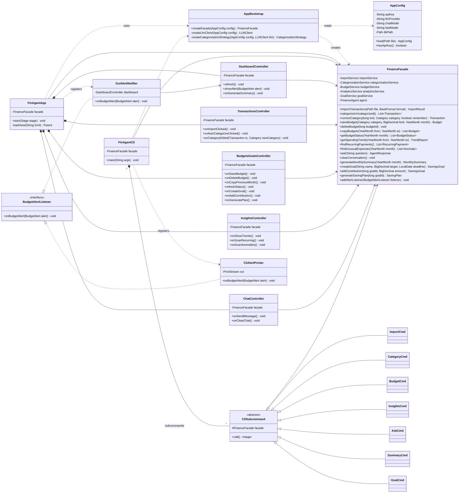

> **Notes.**
> - Each controller is paired with an FXML view file, which is not drawn.
> - `AppConfig.load()`, the `AppBootstrap` methods, and `FinAgentCli.main()` are static.
> - `FinAgentApp` and `FinAgentCli` get their `FinanceFacade` at startup by calling `AppBootstrap.createFacade(config)`, then pass it to the controllers and subcommands.

### 3.2 Service Layer

```mermaid
classDiagram
    direction TB

    class ImportService {
        -ImporterFactory importerFactory
        -TransactionRepository txRepo
        -CategorizationService categorizationService
        +importFile(Path file, BankFormat format) ImportResult
        -removeDuplicates(List~Transaction~ txs) List~Transaction~
    }
    class ImporterFactory {
        +createImporter(BankFormat format) CsvImporter
    }
    class CsvImporter {
        <<abstract>>
        +importFile(Path file) List~Transaction~
        #readRows(Path file) List~CsvRow~
        #validateHeader(CsvRow header) void
        #mapRow(CsvRow row) Transaction
        #normalize(Transaction tx) Transaction
    }
    class TdCsvImporter {
        #validateHeader(CsvRow header) void
        #mapRow(CsvRow row) Transaction
    }
    class RbcCsvImporter {
        #validateHeader(CsvRow header) void
        #mapRow(CsvRow row) Transaction
    }
    class GenericCsvImporter {
        -ColumnMapping mapping
        #validateHeader(CsvRow header) void
        #mapRow(CsvRow row) Transaction
    }

    class CategorizationService {
        -CategorizationStrategy strategy
        -CategoryRuleRepository ruleRepo
        -TransactionRepository txRepo
        +categorize(List~Transaction~ txs) List~Transaction~
        +categorizeUncategorized() List~Transaction~
        +correctCategory(long txId, Category category, boolean remember) Transaction
        +setStrategy(CategorizationStrategy strategy) void
    }
    class CategorizationStrategy {
        <<interface>>
        +categorize(List~Transaction~ txs, List~CategoryRule~ rules) List~Transaction~
    }
    class RuleBasedStrategy {
        +categorize(List~Transaction~ txs, List~CategoryRule~ rules) List~Transaction~
    }
    class LlmStrategy {
        -LLMClient llm
        -PromptBuilder prompts
        -int batchSize
        +categorize(List~Transaction~ txs, List~CategoryRule~ rules) List~Transaction~
        -parseResponse(LlmResponse response) List~CategoryResult~
    }
    class HybridStrategy {
        -RuleBasedStrategy ruleStrategy
        -LlmStrategy llmStrategy
        -double confidenceThreshold
        +categorize(List~Transaction~ txs, List~CategoryRule~ rules) List~Transaction~
    }

    class BudgetService {
        -BudgetRepository budgetRepo
        -TransactionRepository txRepo
        -List~BudgetAlertListener~ listeners
        +saveBudget(Category category, BigDecimal limit, YearMonth month) Budget
        +deleteBudget(long budgetId) void
        +copyBudgets(YearMonth from, YearMonth to) List~Budget~
        +getStatus(YearMonth month) List~BudgetStatus~
        +recalculate(YearMonth month) void
        +addListener(BudgetAlertListener listener) void
        +removeListener(BudgetAlertListener listener) void
        -notifyListeners(BudgetAlert alert) void
    }
    class BudgetAlertListener {
        <<interface>>
        +onBudgetAlert(BudgetAlert alert) void
    }
    class AlertHistoryLogger {
        -AlertRepository alertRepo
        +onBudgetAlert(BudgetAlert alert) void
    }

    class AnalyticsService {
        -TransactionRepository txRepo
        +getTrends(YearMonth from, YearMonth to) TrendReport
        +getMonthlyStats(YearMonth month) MonthlyStats
        +compareMonths(YearMonth a, YearMonth b) MonthComparison
        +detectRecurring() List~RecurringPayment~
        +detectAnomalies(YearMonth month) List~Anomaly~
    }

    class GoalService {
        -GoalRepository goalRepo
        +createGoal(String name, BigDecimal target, LocalDate deadline) SavingsGoal
        +addContribution(long goalId, BigDecimal amount) SavingsGoal
        +getGoal(long goalId) SavingsGoal
        +getAllGoals() List~SavingsGoal~
    }


    ImportService --> ImporterFactory
    ImportService --> CategorizationService
    ImporterFactory ..> CsvImporter : creates
    CsvImporter <|-- TdCsvImporter
    CsvImporter <|-- RbcCsvImporter
    CsvImporter <|-- GenericCsvImporter

    CategorizationService "1" o-- "1" CategorizationStrategy : current strategy
    CategorizationStrategy <|.. RuleBasedStrategy
    CategorizationStrategy <|.. LlmStrategy
    CategorizationStrategy <|.. HybridStrategy
    HybridStrategy *-- RuleBasedStrategy
    HybridStrategy *-- LlmStrategy

    BudgetService "1" o-- "0..*" BudgetAlertListener : observers
    BudgetAlertListener <|.. AlertHistoryLogger
```

> **Notes.**
> - `CsvImporter.importFile()` is the final template method. `validateHeader()` and `mapRow()` are abstract hook steps that each bank-specific subclass overrides.
> - `CsvImporter` wraps OpenCSV's `CSVReader` internally inside `readRows()`.
> - `LlmStrategy` depends on `LLMClient` and `PromptBuilder` from 3.3.
> - Every service depends on the repositories in 3.4.

### 3.3 Agent Layer

```mermaid
classDiagram
    direction TB

    class FinanceAgent {
        -LLMClient llm
        -ToolRegistry tools
        -ConversationMemory memory
        -PromptBuilder prompts
        -int maxSteps
        +ask(String question) AgentResponse
        +labelSubscriptions(List~RecurringPayment~ items) List~RecurringPayment~
        +explainAnomalies(List~Anomaly~ items) List~Anomaly~
        +writeMonthlySummary(MonthlyStats stats) String
        +proposeSavingPlan(SavingsGoal goal) SavingPlan
        +clearMemory() void
        -runLoop(LlmRequest request) AgentResponse
    }

    class ConversationMemory {
        -List~ChatMessage~ messages
        -int maxMessages
        +add(ChatMessage message) void
        +recent() List~ChatMessage~
        +clear() void
    }

    class PromptBuilder {
        +chatSystemPrompt() String
        +categorizationPrompt(List~Transaction~ txs, List~CategoryRule~ examples) String
        +subscriptionPrompt(List~RecurringPayment~ items) String
        +anomalyPrompt(List~Anomaly~ items) String
        +summaryPrompt(MonthlyStats stats) String
        +savingPlanPrompt(SavingsGoal goal) String
    }

    class LLMClient {
        <<interface>>
        +complete(LlmRequest request) LlmResponse
        +getModelName() String
    }
    class ClaudeAdapter {
        -AnthropicClient sdk
        -String model
        +complete(LlmRequest request) LlmResponse
        +getModelName() String
        -toSdkParams(LlmRequest request) MessageCreateParams
        -fromSdkMessage(Message message) LlmResponse
    }
    class MockLlmClient {
        -Queue~LlmResponse~ scripted
        +complete(LlmRequest request) LlmResponse
        +getModelName() String
    }
    class AnthropicClient {
        <<external>>
        +messages() MessageService
    }

    class LlmRequest {
        -String systemPrompt
        -List~ChatMessage~ messages
        -List~ToolSpec~ tools
        -String model
        -int maxTokens
    }
    class LlmResponse {
        -String text
        -List~ToolCall~ toolCalls
        -StopReason stopReason
        +hasToolCalls() boolean
    }
    class ChatMessage {
        -Role role
        -String content
        -String toolCallId
    }
    class ToolCall {
        -String id
        -String name
        -JsonNode arguments
    }
    class ToolResult {
        -String callId
        -String content
        -boolean isError
    }
    class ToolSpec {
        -String name
        -String description
        -JsonNode inputSchema
    }
    class AgentResponse {
        -String answer
        -List~ToolCall~ toolCallsMade
        -int steps
        -boolean truncated
    }

    class ToolRegistry {
        -List~AgentTool~ tools
        +register(AgentTool tool) void
        +getSpecs() List~ToolSpec~
        +execute(ToolCall call) ToolResult
    }
    class AgentTool {
        <<interface>>
        +getSpec() ToolSpec
        +execute(JsonNode args) ToolResult
    }
    class QueryTransactionsTool {
        -TransactionRepository txRepo
        +getSpec() ToolSpec
        +execute(JsonNode args) ToolResult
    }
    class SpendingByCategoryTool {
        -AnalyticsService analytics
        +getSpec() ToolSpec
        +execute(JsonNode args) ToolResult
    }
    class CompareMonthsTool {
        -AnalyticsService analytics
        +getSpec() ToolSpec
        +execute(JsonNode args) ToolResult
    }
    class BudgetStatusTool {
        -BudgetService budgets
        +getSpec() ToolSpec
        +execute(JsonNode args) ToolResult
    }
    class RecurringPaymentsTool {
        -AnalyticsService analytics
        +getSpec() ToolSpec
        +execute(JsonNode args) ToolResult
    }
    class GoalsTool {
        -GoalService goals
        +getSpec() ToolSpec
        +execute(JsonNode args) ToolResult
    }

    FinanceAgent "1" --> "1" LLMClient
    FinanceAgent "1" *-- "1" ConversationMemory
    FinanceAgent "1" *-- "1" PromptBuilder
    FinanceAgent "1" --> "1" ToolRegistry
    FinanceAgent ..> AgentResponse : returns
    FinanceAgent ..> LlmRequest : builds

    LLMClient <|.. ClaudeAdapter
    LLMClient <|.. MockLlmClient
    ClaudeAdapter --> AnthropicClient : adapts
    LLMClient ..> LlmRequest
    LLMClient ..> LlmResponse

    LlmRequest "1" *-- "0..*" ChatMessage
    LlmRequest "1" o-- "0..*" ToolSpec
    LlmResponse "1" *-- "0..*" ToolCall
    ConversationMemory "1" o-- "0..*" ChatMessage

    ToolRegistry "1" o-- "1..*" AgentTool
    ToolRegistry ..> ToolCall
    ToolRegistry ..> ToolResult
    AgentTool <|.. QueryTransactionsTool
    AgentTool <|.. SpendingByCategoryTool
    AgentTool <|.. CompareMonthsTool
    AgentTool <|.. BudgetStatusTool
    AgentTool <|.. RecurringPaymentsTool
    AgentTool <|.. GoalsTool
    AgentTool ..> ToolSpec
```

> **Notes.**
> - Only `ClaudeAdapter` and `MockLlmClient` are planned for Stage 2. The `LLMClient` interface means another provider, such as Gemini or OpenAI, could be added later by writing one new adapter class.
> - The concrete tools hold references to services (`AnalyticsService`, `BudgetService`, `GoalService`) and to `TransactionRepository`. These are the *receivers* in the Command pattern. `FinanceFacade` (3.1) owns `FinanceAgent`, and `LlmStrategy` (3.2) shares the same `LLMClient` interface.

### 3.4 Domain Model and Persistence

```mermaid
classDiagram
    direction TB

    class Transaction {
        -long id
        -LocalDate date
        -String rawDescription
        -String merchant
        -BigDecimal amount
        -Category category
        -CategorySource categorySource
        -double confidence
        -String importBatchId
        +isExpense() boolean
        +setCategory(Category c, CategorySource source, double confidence) void
        +getMonth() YearMonth
    }
    class Category {
        <<enumeration>>
        GROCERIES
        DINING
        TRANSPORT
        RENT
        UTILITIES
        ENTERTAINMENT
        SHOPPING
        SUBSCRIPTIONS
        HEALTH
        EDUCATION
        INCOME
        OTHER
        UNCATEGORIZED
    }
    class CategorySource {
        <<enumeration>>
        RULE
        AI
        USER
        NONE
    }
    class CategoryRule {
        -long id
        -String merchantPattern
        -Category category
        -LocalDateTime createdAt
        +matches(Transaction tx) boolean
    }
    class Budget {
        -long id
        -Category category
        -BigDecimal limit
        -YearMonth month
    }
    class BudgetStatus {
        -Budget budget
        -BigDecimal spent
        +remaining() BigDecimal
        +percentUsed() double
        +level() AlertLevel
    }
    class AlertLevel {
        <<enumeration>>
        OK
        WARNING
        EXCEEDED
    }
    class BudgetAlert {
        -Category category
        -YearMonth month
        -AlertLevel level
        -double percentUsed
        -LocalDateTime createdAt
        +message() String
    }
    class RecurringPayment {
        -String merchant
        -String displayName
        -BigDecimal averageAmount
        -Frequency frequency
        -LocalDate lastCharge
        -LocalDate nextExpected
        -Boolean isSubscription
        +monthlyCost() BigDecimal
    }
    class Frequency {
        <<enumeration>>
        WEEKLY
        MONTHLY
        YEARLY
    }
    class Anomaly {
        -Transaction transaction
        -String statisticalReason
        -double score
        -String explanation
    }
    class SavingsGoal {
        -long id
        -String name
        -BigDecimal targetAmount
        -BigDecimal currentAmount
        -LocalDate deadline
        +progress() double
        +requiredMonthly() BigDecimal
        +isComplete() boolean
    }
    class SavingPlan {
        -SavingsGoal goal
        -BigDecimal monthlyTarget
        -List~String~ suggestions
        -boolean feasible
        -String rationale
    }
    class MonthlyStats {
        -YearMonth month
        -BigDecimal totalIncome
        -BigDecimal totalSpent
        -List~CategoryTotal~ byCategory
        -List~BudgetStatus~ budgetStatuses
        -BigDecimal changeFromPrevious
    }
    class CategoryTotal {
        -Category category
        -BigDecimal amount
    }
    class MonthlySummary {
        -MonthlyStats stats
        -String narrative
        -boolean aiGenerated
    }
    class TrendReport {
        -List~YearMonth~ months
        -List~CategoryTrend~ trends
    }
    class CategoryTrend {
        -Category category
        -List~BigDecimal~ monthlyTotals
        +percentChange() double
    }
    class MonthComparison {
        -YearMonth monthA
        -YearMonth monthB
        -List~CategoryTotal~ differences
    }
    class ImportResult {
        -int importedCount
        -int duplicateCount
        -List~String~ rowErrors
        -Set~YearMonth~ affectedMonths
    }

    class Database {
        -Connection connection
        +getConnection() Connection
        +initSchema() void
    }
    class TransactionRepository {
        +saveAll(List~Transaction~ txs) void
        +update(Transaction tx) void
        +findById(long id) Optional~Transaction~
        +findBetween(LocalDate from, LocalDate to) List~Transaction~
        +findByMonth(YearMonth month) List~Transaction~
        +findUncategorized() List~Transaction~
        +findByMerchant(String merchant) List~Transaction~
        +isDuplicate(Transaction tx) boolean
    }
    class CategoryRuleRepository {
        +findAll() List~CategoryRule~
        +findByMerchant(String merchant) Optional~CategoryRule~
        +save(CategoryRule rule) void
    }
    class BudgetRepository {
        +save(Budget budget) Budget
        +delete(long id) void
        +findByMonth(YearMonth month) List~Budget~
    }
    class GoalRepository {
        +save(SavingsGoal goal) SavingsGoal
        +findById(long id) Optional~SavingsGoal~
        +findAll() List~SavingsGoal~
    }
    class AlertRepository {
        +save(BudgetAlert alert) void
        +findRecent(int limit) List~BudgetAlert~
    }

    Transaction --> Category
    Transaction --> CategorySource
    CategoryRule --> Category
    Budget --> Category
    BudgetStatus "1" --> "1" Budget
    BudgetStatus ..> AlertLevel
    BudgetAlert --> AlertLevel
    RecurringPayment --> Frequency
    RecurringPayment "1" o-- "3..*" Transaction : charges
    Anomaly "1" --> "1" Transaction
    SavingPlan "1" --> "1" SavingsGoal
    MonthlySummary "1" *-- "1" MonthlyStats
    MonthlyStats "1" *-- "0..*" CategoryTotal
    MonthlyStats "1" o-- "0..*" BudgetStatus
    TrendReport "1" *-- "0..*" CategoryTrend
    MonthComparison "1" *-- "0..*" CategoryTotal

    TransactionRepository --> Database
    CategoryRuleRepository --> Database
    BudgetRepository --> Database
    GoalRepository --> Database
    AlertRepository --> Database
    TransactionRepository ..> Transaction
    CategoryRuleRepository ..> CategoryRule
    BudgetRepository ..> Budget
    GoalRepository ..> SavingsGoal
    AlertRepository ..> BudgetAlert
```

> **Note.** `BudgetAlert` is both the event sent to observers and the record stored by `AlertRepository`. This is a deliberate simplification: its fields (category, month, level, percentUsed, createdAt) are exactly what the alert history needs to store, so a separate entity class would only duplicate them.

---

## 4. Design Pattern Explanations

FinAgent uses **seven** design patterns from the course. Each one solves a specific problem in this application.

| # | Pattern | Where | Problem solved |
|---|---|---|---|
| 1 | Facade | `FinanceFacade` | GUI and CLI need one simple, identical way into a large subsystem |
| 2 | MVC | JavaFX views, `*Controller` classes, domain/services | Keep UI code separate from business logic |
| 3 | Strategy | `CategorizationStrategy` | Swap categorization algorithms at runtime |
| 4 | Observer | `BudgetService` + `BudgetAlertListener` | Notify the GUI, CLI, and alert history when budgets cross thresholds |
| 5 | Command | `AgentTool` + `ToolRegistry` | Let the LLM trigger operations by name without the agent knowing each one |
| 6 | Adapter | `LLMClient` + `ClaudeAdapter` | Hide vendor SDKs behind one internal interface |
| 7 | Template Method | `CsvImporter` + bank subclasses | Share the import algorithm while varying bank-specific steps |

Two supporting patterns are used but **not counted** toward the requirement:
- **Repository/DAO:** data access through `*Repository` classes.
- **Simple Factory:** `ImporterFactory`.

### 4.1 Facade

**Design problem.** FinAgent has five services plus an agent, and many features need several of them working together. For example, importing must call `ImportService` and then `BudgetService.recalculate()` for each affected month. The project also requires two interfaces, a GUI and a CLI. Without a single entry point, both interfaces would duplicate this coordination logic, and the duplicates would drift apart.

**Participating classes and roles.**
- `FinanceFacade`: **Facade.** Exposes one method per user-level operation.
- The 5 GUI controllers and 7 `CliSubcommand`s: **clients.**
- `ImportService`, `CategorizationService`, `BudgetService`, `AnalyticsService`, `GoalService`, and `FinanceAgent`: **subsystem classes.**

**Why appropriate.** The "two front ends, one back end" requirement is exactly what Facade is for. Every feature is implemented once, behind the facade. The GUI and CLI only translate user input into facade calls and render the results, so the CLI gets every feature at almost no extra cost.

**Without it.** Each controller and CLI subcommand would need references to several services and would have to repeat orchestration, such as recalculating budgets after an import or correction. A change to that flow would have to be made in every controller and CLI subcommand that triggers it, and the GUI and CLI could easily start behaving differently.

### 4.2 Model-View-Controller (MVC)

**Design problem.** The GUI has four tabs plus a chat panel. Mixing JavaFX layout code with finance logic would make the logic untestable and the UI fragile.

**Participating classes and roles.**
- **Model:** domain classes (`Transaction`, `Budget`, `SavingsGoal`, and so on) and the service layer, reached through `FinanceFacade`.
- **View:** FXML layouts (`transactions.fxml`, `budgets.fxml`, and so on), rendered by JavaFX.
- **Controller:** `DashboardController`, `TransactionsController`, `BudgetsGoalsController`, `InsightsController`, `ChatController`. Each handles UI events, calls the facade, and updates its view.

**Why appropriate.** JavaFX is designed around FXML views with controller classes, so MVC is the natural structure. Because the model has no JavaFX dependency, the same model serves the CLI unchanged.

**Without it.** Business rules would sit inside button handlers. They could not be unit-tested without starting a GUI, and the CLI would need its own copy of that logic.

### 4.3 Strategy

**Design problem.** Categorization has to work in different situations:
- with an API key, using the hybrid of rules plus AI;
- without a key or offline, using rules only;
- in testing or comparison, using AI only.

FinAgent switches between these at startup based on `AppConfig`, and at runtime if the API becomes unavailable.

**Participating classes and roles.**
- `CategorizationService`: **Context.** Holds the current strategy and has `setStrategy()`.
- `CategorizationStrategy`: **Strategy interface.**
- `RuleBasedStrategy`, `LlmStrategy`, `HybridStrategy`: **Concrete strategies.** `HybridStrategy` composes the other two.

**Why appropriate.** The alternatives are interchangeable algorithms with identical inputs and outputs, and the choice depends on runtime conditions. That is the textbook use of Strategy. It also makes the AI fallback a one-line change: `setStrategy(new RuleBasedStrategy())`.

**Without it.** `CategorizationService` would contain `if (aiEnabled) ... else if (offline) ...` branches mixed with rule-matching and LLM code. Every new approach, such as a local model, would mean editing and retesting that class.

### 4.4 Observer

**Design problem.** Several parts of the system must react when spending crosses a budget threshold:
- the GUI dashboard shows a banner;
- the CLI prints a warning;
- the alert history saves a record.

The change can come from three different features: an import, a category correction, or a budget edit. `BudgetService` should not know which interface is running or what each one does with the alert.

**Participating classes and roles.**
- `BudgetService`: **Subject.** Has `addListener()`, `removeListener()`, and `notifyListeners()`.
- `BudgetAlertListener`: **Observer interface.**
- `GuiAlertNotifier`, `CliAlertPrinter`, `AlertHistoryLogger`: **Concrete observers.**
- `BudgetAlert`: the event data sent to observers.

**Why appropriate.** This is a one-to-many dependency where the set of listeners depends on the runtime. The GUI registers `GuiAlertNotifier`, the CLI registers `CliAlertPrinter`, and `AlertHistoryLogger` is always registered. Observer lets that set change without modifying the subject.

**Without it.** `BudgetService` would need direct references to GUI and CLI classes. That would create a dependency from the service layer up to the presentation layer and break the layering. Adding a new alert channel, such as desktop notifications, would also mean editing `BudgetService`.

### 4.5 Command

**Design problem.** The LLM decides at runtime which operation to perform, by returning a tool name and JSON arguments. The agent loop must execute that request without hardcoding a `switch` over every possible operation. Each operation also has to describe itself (name, description, input schema) so the LLM knows it exists.

**Participating classes and roles.**
- `AgentTool`: **Command interface.** Has `execute(JsonNode args)` and `getSpec()`.
- `QueryTransactionsTool`, `SpendingByCategoryTool`, `CompareMonthsTool`, `BudgetStatusTool`, `RecurringPaymentsTool`, `GoalsTool`: **Concrete commands.**
- `ToolRegistry`: **Invoker.** Looks up a command by name and calls `execute()`.
- `FinanceAgent`: **Client.** Receives tool calls from the LLM and passes them to the invoker.
- `AnalyticsService`, `BudgetService`, `GoalService`, `TransactionRepository`: **Receivers** that do the actual work.

**Why appropriate.** Each tool call is a request packaged as an object (name plus arguments) and executed later by an invoker that does not know its details. That is Command. It also gives a single place in `ToolRegistry.execute()` to validate arguments, catch exceptions and convert them to error results, and log every tool call for the "How I got this" panel.

**Without it.** `FinanceAgent` would contain a growing `switch (toolName)` with argument parsing for every operation. Each new tool would mean editing the agent loop, and error handling and logging would be repeated in every branch.

### 4.6 Adapter

**Design problem.** The Anthropic SDK has its own request and response classes and a tool-call format that differ from what our code needs. The agent and `LlmStrategy` should not depend on it directly. Otherwise SDK changes, or a future switch of provider, would ripple through the system, and testing would require network calls.

**Participating classes and roles.**
- `LLMClient`: **Target interface** that FinAgent code uses (`complete(LlmRequest)`).
- `ClaudeAdapter`: **Adapter.** It converts `LlmRequest` to the SDK format and converts SDK responses back to `LlmResponse` (`toSdkParams()`, `fromSdkMessage()`).
- `AnthropicClient` (Anthropic SDK): **Adaptee.**
- `FinanceAgent`, `LlmStrategy`: **Clients.**
- `MockLlmClient`: an extra implementation of the target used in tests.

**Why appropriate.** The Anthropic SDK is a fixed third-party interface that we cannot change, and it does not match the interface our code needs. Adapter exists to solve exactly this mismatch.

**Without it.** Anthropic SDK types would appear throughout `FinanceAgent`, `LlmStrategy`, and the tools. Upgrading the SDK or changing providers would mean rewriting the agent, and unit tests would need a real API key and network access.

### 4.7 Template Method

**Design problem.** Every bank's CSV import follows the same algorithm:

1. Read the rows.
2. Validate the header.
3. Map each row to a `Transaction`.
4. Normalize merchant names and amount signs.

Only steps 2 and 3 differ between banks. TD, RBC, and a user-mapped generic format have different columns, date formats, and sign conventions.

**Participating classes and roles.**
- `CsvImporter`: **Abstract class.**
  - `importFile()` is the final **template method** that fixes the order of steps.
  - `readRows()` and `normalize()` are shared **concrete steps**.
  - `validateHeader()` and `mapRow()` are **abstract primitive operations**.
- `TdCsvImporter`, `RbcCsvImporter`, `GenericCsvImporter`: **Concrete classes** that implement the primitive operations.

**Why appropriate.** The algorithm's structure is fixed and only certain steps vary by subclass, which is the definition of Template Method. Adding a new bank means writing one small subclass with two methods.

**Without it.** Each importer would copy the reading, normalization, and error-collection code. A bug fix in normalization would have to be repeated in every importer. Alternatively, one importer would contain a large `if (bank == TD) ... else if (bank == RBC)` block.

---

## 5. Use-Case Diagram

**Actors:**

- **User** (primary actor): the person managing their finances through the GUI or the CLI.
- **LLM Service** (secondary actor, external): the Anthropic Messages API, which provides categorization, explanations, summaries, and agent reasoning.
- **File System** (secondary actor): the source of imported CSV files.

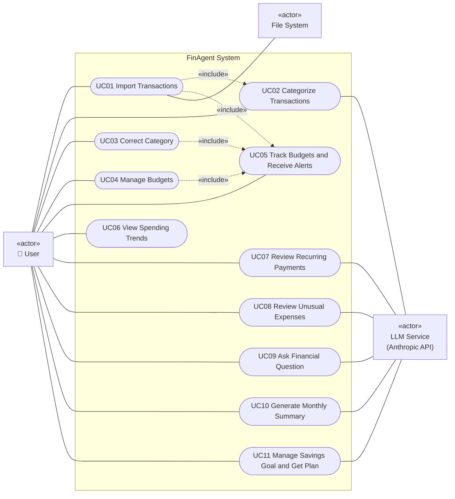

**Relationships:**

- **UC01 «include» UC02:** every import automatically categorizes the new transactions.
- **UC01, UC03, UC04 «include» UC05:** imports, corrections, and budget changes always trigger budget recalculation and possible alerts.
- **UC03 and rule learning:** creating and applying a merchant rule is part of UC03's main scenario, not a separate use case. It only ever happens as part of a category correction, when the user ticks "remember."

---

## 6. Use-Case Descriptions

### UC01: Import Transactions

| Field | Description |
|---|---|
| **Actors** | User (primary), File System |
| **Goal** | Load a bank CSV export into FinAgent as standardized, categorized transactions. |
| **Preconditions** | The application is running. The user has a CSV export from a supported bank, or a CSV whose columns they can map. |
| **Trigger** | The user clicks **Import CSV** on the Transactions tab, or runs `finagent import`. |
| **Main success scenario** | 1. User selects a file and bank format.<br/>2. System creates the matching importer and parses the file.<br/>3. System validates the header and maps each row to a transaction.<br/>4. System removes duplicates.<br/>5. System categorizes the new transactions (UC02).<br/>6. System saves them.<br/>7. System recalculates budgets for the affected months (UC05).<br/>8. System displays the import summary and refreshes the table. |
| **Alternative / exception flows** | **2a.** File unreadable: show error, return to step 1.<br/>**3a.** Header mismatch: reject file, suggest the Generic format, return to step 1.<br/>**3b.** Some rows malformed: skip them, list them in the summary, continue.<br/>**4a.** All rows duplicates: show "No new transactions," end. |
| **Postconditions** | New transactions are stored and categorized where possible. Budget statuses are current. |
| **Related features** | F01, F02, F05 |

### UC02: Categorize Transactions

| Field | Description |
|---|---|
| **Actors** | User (primary), LLM Service |
| **Goal** | Assign a category to every uncategorized transaction. |
| **Preconditions** | Uncategorized transactions exist. |
| **Trigger** | Included in UC01, or the user clicks **Auto-Categorize** / runs `finagent category auto`. |
| **Main success scenario** | 1. System loads the saved category rules.<br/>2. System applies the rules and marks matches with source `RULE`.<br/>3. System sends unmatched transactions in batches to the LLM Service, with rules as examples.<br/>4. LLM Service returns a category and confidence for each.<br/>5. System validates the results, applies those at or above 0.6 confidence with source `AI`, and flags the rest for review.<br/>6. System saves the results and refreshes the table. |
| **Alternative / exception flows** | **3a.** No API key or network: switch to rules only, notify the user, skip to step 6.<br/>**4a.** Invalid response: retry once. If it fails again, leave the batch uncategorized.<br/>**5a.** Category not in the allowed list: discard that result. |
| **Postconditions** | Transactions carry category, source, and confidence. Low-confidence items are flagged. |
| **Related features** | F02 |

### UC03: Correct Category

| Field | Description |
|---|---|
| **Actors** | User |
| **Goal** | Fix a wrong category and optionally teach the system to remember it. |
| **Preconditions** | The transaction exists. |
| **Trigger** | The user edits the category cell, or runs `finagent category set`. |
| **Main success scenario** | 1. User selects a new category and optionally ticks "remember."<br/>2. System updates the transaction with source `USER`.<br/>3. If remember is set, system saves a merchant rule and applies it to matching transactions with `AI` or `UNCATEGORIZED` source.<br/>4. System recalculates the month's budgets (UC05).<br/>5. System refreshes the table. |
| **Alternative / exception flows** | **1a.** User cancels: no change.<br/>**3a.** A conflicting rule exists: ask to overwrite. If the user declines, save only the single correction. |
| **Postconditions** | The transaction is corrected. A rule may exist for future imports and AI prompts. |
| **Related features** | F03, F05 |

### UC04: Manage Budgets

| Field | Description |
|---|---|
| **Actors** | User |
| **Goal** | Create, edit, delete, or copy monthly category budgets. |
| **Preconditions** | None. |
| **Trigger** | The user uses the Budgets & Goals tab, or runs `finagent budget set` / `copy`. |
| **Main success scenario** | 1. User chooses a month, category, and limit.<br/>2. System validates the input.<br/>3. System creates the budget, or updates it if one already exists.<br/>4. System recalculates status (UC05).<br/>5. System shows the updated list. |
| **Alternative / exception flows** | **2a.** Invalid amount: show validation error.<br/>**3a.** Duplicate category: confirm the replacement.<br/>**1b.** User chooses "Copy from previous month." System copies all budgets. If none exist, it shows a message. |
| **Postconditions** | Budgets are stored and status is current. |
| **Related features** | F04, F05 |

### UC05: Track Budgets and Receive Alerts

| Field | Description |
|---|---|
| **Actors** | User |
| **Goal** | See budget progress and be warned before or when a limit is exceeded. |
| **Preconditions** | At least one budget exists for the month. |
| **Trigger** | Included in UC01, UC03, or UC04, or the user opens the Budgets & Goals tab / runs `finagent budget status`. |
| **Main success scenario** | 1. System sums the month's spending per budgeted category.<br/>2. System computes the percentage used and alert level.<br/>3. If a budget reaches a new, higher level, system notifies all registered listeners.<br/>4. Listeners show a banner (GUI), print a warning (CLI), and record the alert in history.<br/>5. System displays the progress bars or status table. |
| **Alternative / exception flows** | **3a.** Level already notified: no repeat alert.<br/>**1a.** No budgets for the month: show "No budgets set" with a link to UC04. |
| **Postconditions** | Status is shown and new alerts are recorded. |
| **Related features** | F05 |

### UC06: View Spending Trends

| Field | Description |
|---|---|
| **Actors** | User |
| **Goal** | Understand how spending is distributed and how it changes over time. |
| **Preconditions** | Transactions exist. |
| **Trigger** | Insights tab → **Trends**, or `finagent insights trends`. |
| **Main success scenario** | 1. User selects a month range.<br/>2. System retrieves the transactions and aggregates them by month and category.<br/>3. System computes month-over-month changes.<br/>4. System renders the pie chart, bar chart, and comparison table (or a CLI table). |
| **Alternative / exception flows** | **1a.** Invalid range: show error.<br/>**2a.** No data: show empty state.<br/>**1b.** Range over 24 months: cap it and notify. |
| **Postconditions** | None. This is a read-only use case. |
| **Related features** | F06 |

### UC07: Review Recurring Payments

| Field | Description |
|---|---|
| **Actors** | User, LLM Service |
| **Goal** | See all recurring charges and identify subscriptions. |
| **Preconditions** | At least 3 months of transactions exist, for best results. |
| **Trigger** | Insights tab → **Recurring** → **Scan**, or `finagent insights recurring`. |
| **Main success scenario** | 1. System analyzes the last 6 months and detects recurring candidates by interval and amount consistency.<br/>2. System sends the candidates to the LLM Service.<br/>3. LLM Service returns a display name and subscription flag for each.<br/>4. System shows the list and total monthly subscription cost. |
| **Alternative / exception flows** | **1a.** Under 3 months of data: warn that results may be incomplete.<br/>**1b.** No candidates: show message, end.<br/>**3a.** LLM unavailable: show candidates as "Unlabeled." |
| **Postconditions** | None. This is a read-only use case. |
| **Related features** | F07 |

### UC08: Review Unusual Expenses

| Field | Description |
|---|---|
| **Actors** | User, LLM Service |
| **Goal** | Find and understand abnormal transactions in a month. |
| **Preconditions** | Transactions exist for the selected month. |
| **Trigger** | Insights tab → **Unusual Expenses** → **Scan**, or `finagent insights anomalies`. |
| **Main success scenario** | 1. User selects a month.<br/>2. System computes baselines from the previous 3 months and flags outliers.<br/>3. System sends the flagged items with their baseline figures to the LLM Service.<br/>4. LLM Service returns a plain-language explanation for each.<br/>5. System displays the anomalies with their explanations. |
| **Alternative / exception flows** | **2a.** Under 2 months of history: use the new-merchant rule only.<br/>**2b.** Nothing flagged: show "Nothing unusual," end.<br/>**4a.** LLM failure: show the statistical reason instead. |
| **Postconditions** | None. This is a read-only use case. |
| **Related features** | F08 |

### UC09: Ask Financial Question

| Field | Description |
|---|---|
| **Actors** | User, LLM Service |
| **Goal** | Get an accurate, data-backed answer to a natural-language question about personal finances. |
| **Preconditions** | An API key is configured and transactions exist. |
| **Trigger** | The user sends a message in the chat panel, or runs `finagent ask`. |
| **Main success scenario** | 1. User enters a question.<br/>2. System adds it to conversation memory and sends it to the LLM Service with history and tool specifications.<br/>3. LLM Service requests one or more tool calls.<br/>4. System executes each tool against local data and returns the results.<br/>5. Steps 3 and 4 repeat until the LLM Service returns a final answer.<br/>6. System stores the answer in memory and shows it with the list of tools used. |
| **Alternative / exception flows** | **3a.** Question out of scope or asks for investment advice: the agent declines with the informational-use notice.<br/>**3b.** Question ambiguous: the agent asks a clarifying question, and the user replies (back to step 1).<br/>**4a.** Tool error: an error result is returned to the LLM, which retries or explains.<br/>**5a.** Six steps reached: return a partial answer marked incomplete.<br/>**2a.** API unavailable: show an offline message. |
| **Postconditions** | The question and answer are stored in conversation memory for follow-ups. |
| **Related features** | F09 |

### UC10: Generate Monthly Summary

| Field | Description |
|---|---|
| **Actors** | User, LLM Service |
| **Goal** | Get a readable recap of a month with saving suggestions. |
| **Preconditions** | Transactions exist for the month. |
| **Trigger** | Dashboard → **Generate Summary**, or `finagent summary`. |
| **Main success scenario** | 1. User selects a month.<br/>2. System computes the monthly statistics and budget results.<br/>3. System sends only these statistics to the LLM Service.<br/>4. LLM Service returns a narrative with three suggestions.<br/>5. System displays the summary. |
| **Alternative / exception flows** | **2a.** No transactions: show error, end.<br/>**4a.** LLM failure: show a stats-only summary marked "AI summary unavailable." |
| **Postconditions** | A `MonthlySummary` is available for viewing. |
| **Related features** | F10 |

### UC11: Manage Savings Goal and Get Plan

| Field | Description |
|---|---|
| **Actors** | User, LLM Service |
| **Goal** | Track progress toward a savings goal and get an actionable plan to reach it. |
| **Preconditions** | None to create a goal. A plan needs spending history. |
| **Trigger** | Budgets & Goals tab actions, or `finagent goal create` / `contribute` / `plan`. |
| **Main success scenario** | 1. User creates a goal with a name, target, and deadline.<br/>2. System validates and saves it.<br/>3. User optionally logs contributions, and system updates progress.<br/>4. User requests an AI plan.<br/>5. System starts an agent task. The LLM Service calls spending and recurring-payment tools, and the system executes them.<br/>6. LLM Service returns a plan.<br/>7. System parses and displays the monthly target, suggestions, and feasibility. |
| **Alternative / exception flows** | **2a.** Invalid target or deadline: show validation error.<br/>**4a.** Goal already complete: show "Goal complete," end.<br/>**6a.** Infeasible: plan is marked infeasible with a suggested new deadline.<br/>**6b.** LLM failure: show only the deterministic required monthly amount. |
| **Postconditions** | Goal and progress are stored. A plan is displayed. |
| **Related features** | F11 |

## 7. Sequence Diagrams

Eight sequence diagrams cover all 11 features. Features with the same interaction structure share a diagram, as the instructions allow:
- F07 and F08 share SD05.

Every feature is available from both the GUI and the CLI through the same `FinanceFacade` method. To avoid duplicate diagrams, most sequence diagrams show the GUI entry path. The CLI path is identical below the facade, with a `CliSubcommand` (for example `ImportCmd` or `BudgetCmd`) taking the place of the GUI controller. SD06 draws both entry paths explicitly, as a worked example of this shared entry point.

| SD | Title | Features |
|---|---|---|
| SD01 | Import and Auto-Categorize Transactions | F01, F02, F05 |
| SD02 | Correct Category and Learn Rule | F03, F05 |
| SD03 | Save Budget and Raise Alerts | F04, F05 |
| SD04 | View Spending Trends | F06 |
| SD05 | Detect Recurring Payments and Unusual Expenses | F07, F08 |
| SD06 | Agent Answers a Financial Question (GUI and CLI) | F09 |
| SD07 | Generate Monthly Summary | F10 |
| SD08 | Create Savings Goal and Generate AI Plan | F11 |

### SD01: Import and Auto-Categorize Transactions (F01, F02, F05)

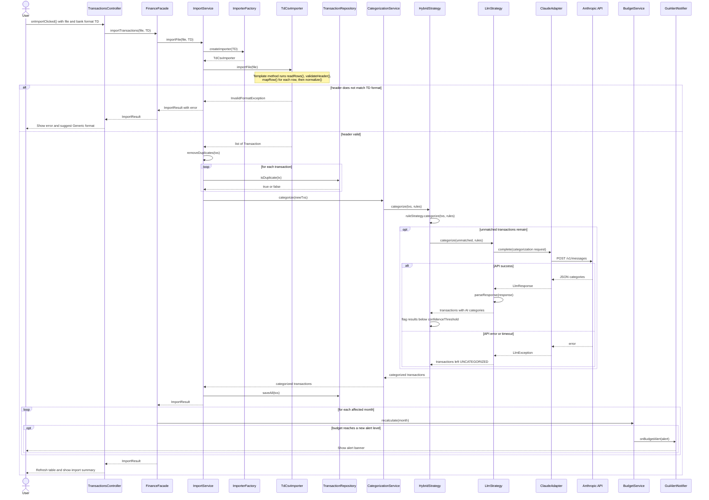

### SD02: Correct Category and Learn Rule (F03, F05)

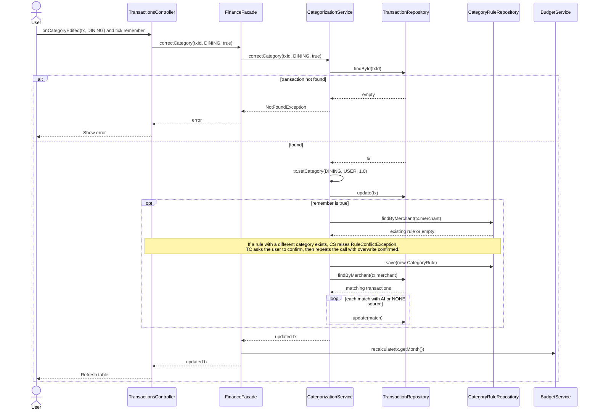

### SD03: Save Budget and Raise Alerts (F04, F05)

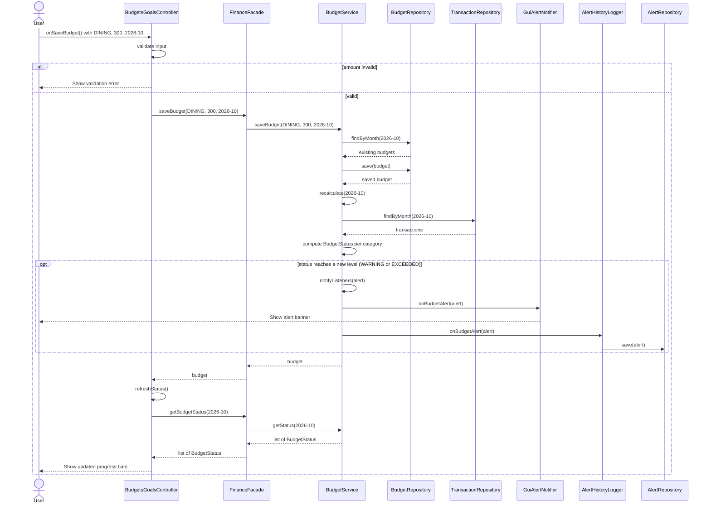

### SD04: View Spending Trends (F06)

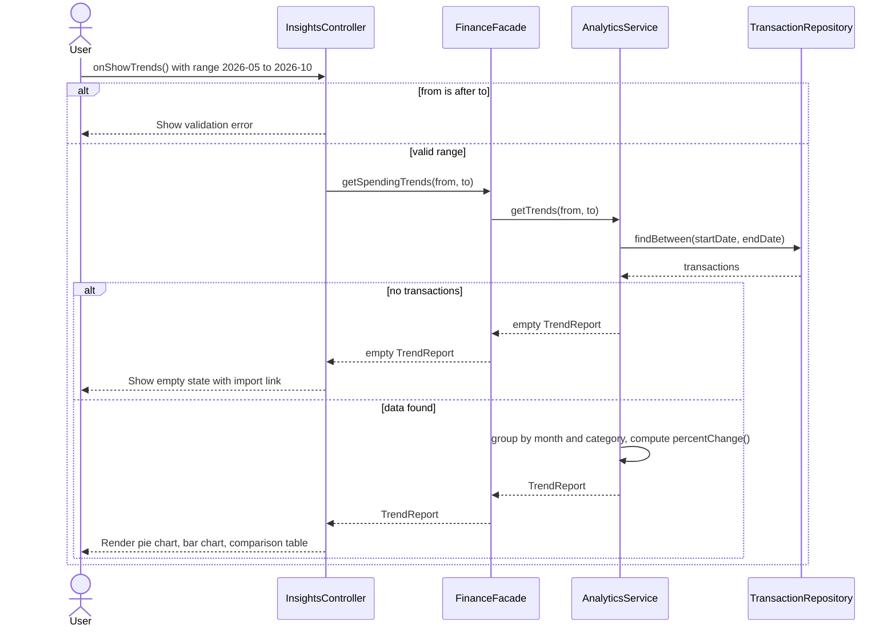

### SD05: Detect Recurring Payments and Unusual Expenses (F07, F08)

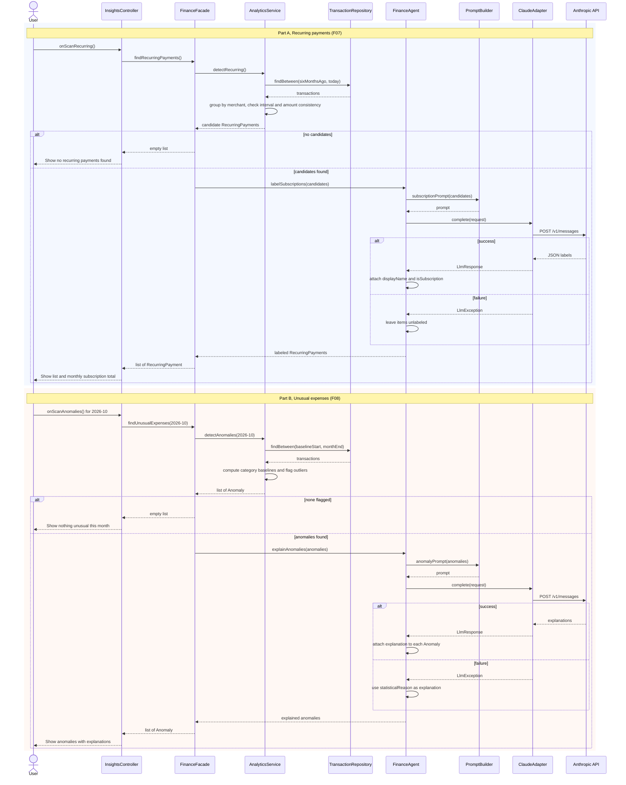

### SD06: Agent Answers a Financial Question, GUI and CLI (F09)

This diagram shows the core agent loop. The LLM chooses tools by name, `ToolRegistry` (Command invoker) runs them, and results are fed back until the LLM produces a final answer.

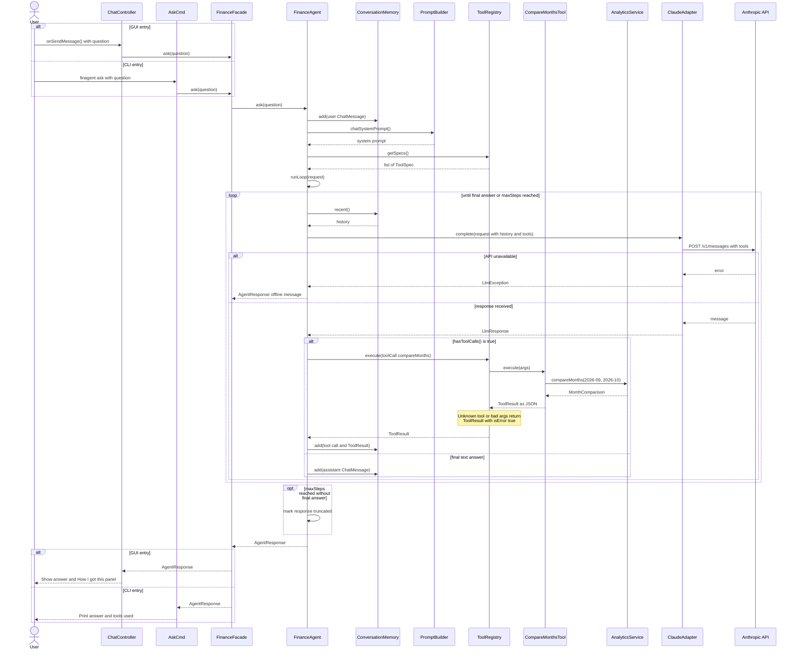

### SD07: Generate Monthly Summary (F10)

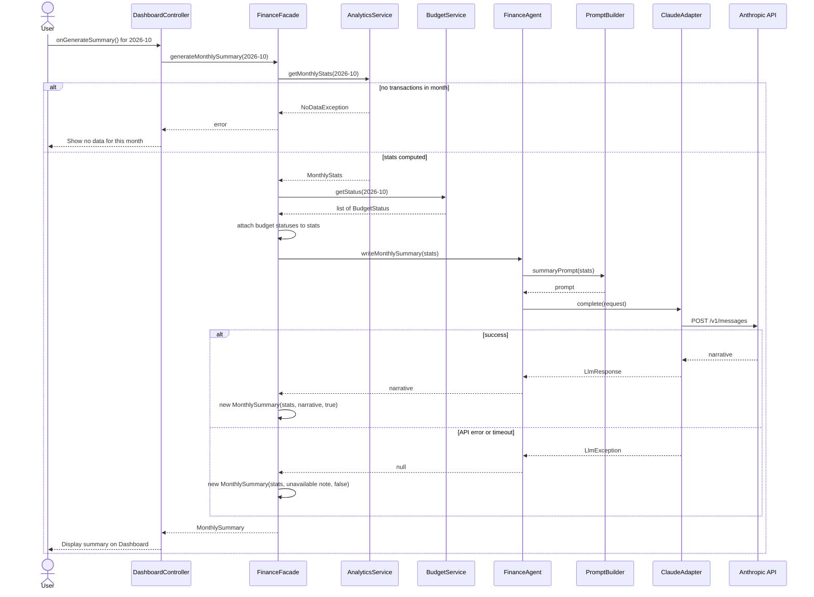

### SD08: Create Savings Goal and Generate AI Plan (F11)

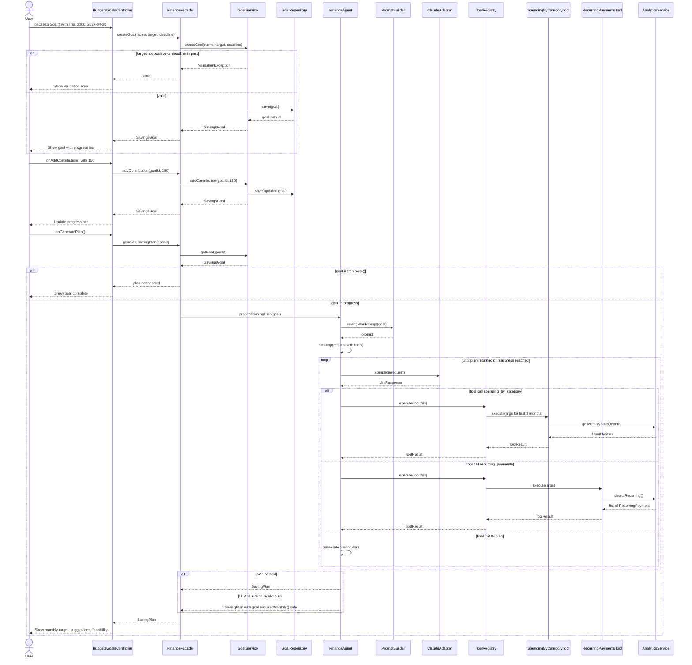

---

## 8. Feature-to-Design Traceability Table

| Feature | Description | Type | Use Case | Classes | Key Methods | SD | Design Pattern(s) |
|---|---|---|---|---|---|---|---|
| **F01** | Import transactions from bank CSV | Deterministic | UC01 | TransactionsController, ImportCmd, FinanceFacade, ImportService, ImporterFactory, CsvImporter, TdCsvImporter, RbcCsvImporter, GenericCsvImporter, TransactionRepository | `importTransactions()`, `importFile()`, `createImporter()`, `validateHeader()`, `mapRow()`, `isDuplicate()`, `saveAll()` | SD01 | Template Method, Facade, MVC |
| **F02** | AI auto-categorization | Hybrid | UC02 | CategorizationService, CategorizationStrategy, HybridStrategy, RuleBasedStrategy, LlmStrategy, PromptBuilder, LLMClient, ClaudeAdapter, CategoryRuleRepository | `categorize()`, `categorizeUncategorized()`, `categorizationPrompt()`, `complete()`, `parseResponse()` | SD01 | Strategy, Adapter, Facade |
| **F03** | Correct category and learn rule | Hybrid | UC03 | TransactionsController, CategoryCmd, FinanceFacade, CategorizationService, CategoryRule, CategoryRuleRepository, TransactionRepository, BudgetService | `onCategoryEdited()`, `correctCategory()`, `setCategory()`, `findByMerchant()`, `save()`, `recalculate()` | SD02 | Facade, Observer |
| **F04** | Create, edit, delete, copy budgets | Deterministic | UC04 | BudgetsGoalsController, BudgetCmd, FinanceFacade, BudgetService, BudgetRepository, Budget | `onSaveBudget()`, `saveBudget()`, `deleteBudget()`, `copyBudgets()`, `findByMonth()` | SD03 | Facade, MVC |
| **F05** | Budget tracking and threshold alerts | Deterministic | UC05 | BudgetService, BudgetStatus, BudgetAlert, BudgetAlertListener, GuiAlertNotifier, CliAlertPrinter, AlertHistoryLogger, AlertRepository | `recalculate()`, `getStatus()`, `notifyListeners()`, `onBudgetAlert()`, `addListener()` | SD01, SD03 | Observer |
| **F06** | Spending trends and charts | Deterministic | UC06 | InsightsController, InsightsCmd, FinanceFacade, AnalyticsService, TrendReport, CategoryTrend, TransactionRepository | `onShowTrends()`, `getSpendingTrends()`, `getTrends()`, `findBetween()`, `percentChange()` | SD04 | Facade, MVC |
| **F07** | Recurring payment and subscription detection | Hybrid | UC07 | InsightsController, FinanceFacade, AnalyticsService, RecurringPayment, FinanceAgent, PromptBuilder, LLMClient, ClaudeAdapter | `findRecurringPayments()`, `detectRecurring()`, `labelSubscriptions()`, `subscriptionPrompt()`, `complete()` | SD05 | Adapter, Facade |
| **F08** | Unusual expense detection with explanations | Hybrid | UC08 | InsightsController, FinanceFacade, AnalyticsService, Anomaly, FinanceAgent, PromptBuilder, LLMClient, ClaudeAdapter | `findUnusualExpenses()`, `detectAnomalies()`, `explainAnomalies()`, `anomalyPrompt()`, `complete()` | SD05 | Adapter, Facade |
| **F09** | Natural-language financial queries | AI (agent) | UC09 | ChatController, AskCmd, FinanceFacade, FinanceAgent, ConversationMemory, PromptBuilder, ToolRegistry, AgentTool + 6 tools, LLMClient, ClaudeAdapter, AgentResponse | `ask()`, `runLoop()`, `getSpecs()`, `execute()`, `complete()`, `add()`, `recent()` | SD06 | Command, Adapter, Facade |
| **F10** | Monthly summary generation | Hybrid | UC10 | DashboardController, SummaryCmd, FinanceFacade, AnalyticsService, BudgetService, FinanceAgent, PromptBuilder, LLMClient, MonthlyStats, MonthlySummary | `generateMonthlySummary()`, `getMonthlyStats()`, `getStatus()`, `writeMonthlySummary()`, `summaryPrompt()` | SD07 | Adapter, Facade |
| **F11** | Savings goals and AI saving plan | Hybrid | UC11 | BudgetsGoalsController, GoalCmd, FinanceFacade, GoalService, GoalRepository, SavingsGoal, FinanceAgent, ToolRegistry, SpendingByCategoryTool, RecurringPaymentsTool, SavingPlan | `createGoal()`, `addContribution()`, `generateSavingPlan()`, `proposeSavingPlan()`, `runLoop()`, `execute()` | SD08 | Command, Adapter, Facade |

**Pattern coverage check.** Every one of the seven patterns appears in at least one feature row:

| Pattern | Features |
|---|---|
| Facade | F01 to F11 |
| MVC | All GUI features; listed explicitly for F01, F04, F06 |
| Strategy | F02 |
| Observer | F03, F05 |
| Command | F09, F11 |
| Adapter | F02, F07 to F11 |
| Template Method | F01 |

---

## 9. Feature Implementation Explanations

### F01: Import Transactions

**Related use case:** UC01 · **Related sequence diagram:** SD01

**Classes involved:**
- `TransactionsController` / `ImportCmd`: collect the file and bank format.
- `FinanceFacade`: entry point. Triggers budget recalculation after import.
- `ImportService`: coordinates parsing, deduplication, categorization, and saving.
- `ImporterFactory`: returns the correct `CsvImporter` subclass.
- `CsvImporter`, `TdCsvImporter`, `RbcCsvImporter`, `GenericCsvImporter`: parse bank-specific formats through a shared template method.
- `TransactionRepository`: checks duplicates and saves.

**Important methods:** `TransactionsController.onImportClicked()`, `FinanceFacade.importTransactions()`, `ImportService.importFile()`, `ImporterFactory.createImporter()`, `CsvImporter.importFile()`, `TdCsvImporter.validateHeader()`, `TdCsvImporter.mapRow()`, `TransactionRepository.isDuplicate()`, `TransactionRepository.saveAll()`

**Execution.**
1. The controller passes the file and format to `FinanceFacade.importTransactions()`, which delegates to `ImportService.importFile()`.
2. The service asks `ImporterFactory` for the right importer and calls its template method `importFile()`. That method calls `readRows()`, then the subclass's `validateHeader()` and `mapRow()`, then `normalize()`.
3. Duplicates are removed using `isDuplicate()`.
4. New transactions are categorized (F02) and saved with `saveAll()`.
5. The returned `ImportResult` lists the affected months. The facade calls `BudgetService.recalculate()` for each one (F05) and returns the result to the GUI.

### F02: AI Auto-Categorization

**Related use case:** UC02 · **Related sequence diagram:** SD01

**Classes involved:**
- `CategorizationService`: context that holds the active strategy.
- `HybridStrategy`, `RuleBasedStrategy`, `LlmStrategy`: categorization algorithms.
- `PromptBuilder`: builds the categorization prompt with rules as examples.
- `LLMClient` / `ClaudeAdapter`: call Claude Haiku.
- `CategoryRuleRepository`: provides saved rules.

**Important methods:** `CategorizationService.categorize()`, `HybridStrategy.categorize()`, `RuleBasedStrategy.categorize()`, `LlmStrategy.categorize()`, `PromptBuilder.categorizationPrompt()`, `ClaudeAdapter.complete()`, `LlmStrategy.parseResponse()`

**Execution.**
1. `CategorizationService.categorize()` loads the rules and calls the current strategy.
2. `HybridStrategy` first runs `RuleBasedStrategy` and marks matches as `RULE`.
3. Unmatched transactions go to `LlmStrategy`. It builds a prompt with `categorizationPrompt()`, calls `LLMClient.complete()` in batches, and validates the JSON with `parseResponse()`.
4. Results at or above the confidence threshold get source `AI`. The rest stay `UNCATEGORIZED` and are flagged.
5. If `AppConfig.hasApiKey()` is false, `AppBootstrap` installs `RuleBasedStrategy` instead. If the API fails at runtime, the service falls back the same way through `setStrategy()`.

### F03: Category Correction and Learning

**Related use case:** UC03 · **Related sequence diagram:** SD02

**Classes involved:**
- `TransactionsController` / `CategoryCmd`: capture the correction.
- `FinanceFacade`: delegates and then recalculates budgets.
- `CategorizationService`: applies the correction and creates the rule.
- `CategoryRule`, `CategoryRuleRepository`: store the learned rule.
- `TransactionRepository`: updates transactions.
- `BudgetService`: recalculates.

**Important methods:** `TransactionsController.onCategoryEdited()`, `FinanceFacade.correctCategory()`, `CategorizationService.correctCategory()`, `Transaction.setCategory()`, `CategoryRuleRepository.findByMerchant()`, `CategoryRuleRepository.save()`, `TransactionRepository.findByMerchant()`, `BudgetService.recalculate()`

**Execution.**
1. `correctCategory()` loads the transaction, sets the new category with source `USER`, and updates it.
2. If remember is set, it checks for a conflicting rule, saves a new `CategoryRule`, and applies it to other transactions from that merchant with `AI` or `NONE` source.
3. The facade then calls `BudgetService.recalculate()` for the transaction's month, which may notify observers (F05).
4. Saved rules are passed to `RuleBasedStrategy` and included as examples by `PromptBuilder.categorizationPrompt()`, so future categorization improves.

### F04: Budget Management

**Related use case:** UC04 · **Related sequence diagram:** SD03

**Classes involved:**
- `BudgetsGoalsController` / `BudgetCmd`: input.
- `FinanceFacade`: entry point.
- `BudgetService`: business rules.
- `BudgetRepository`: storage.
- `Budget`: domain object.

**Important methods:** `BudgetsGoalsController.onSaveBudget()`, `BudgetsGoalsController.onCopyPreviousMonth()`, `FinanceFacade.saveBudget()`, `FinanceFacade.copyBudgets()`, `BudgetService.saveBudget()`, `BudgetService.copyBudgets()`, `BudgetService.deleteBudget()`, `BudgetRepository.findByMonth()`, `BudgetRepository.save()`

**Execution.**
1. The controller validates the input and calls `saveBudget()`.
2. `BudgetService` checks `findByMonth()` for an existing budget in that category, then creates or updates it with `save()`.
3. `copyBudgets()` reads the previous month's budgets and saves copies for the new month.
4. Every change ends with `recalculate()` so statuses and alerts stay current (F05).

### F05: Budget Tracking and Alerts

**Related use case:** UC05 · **Related sequence diagrams:** SD01, SD03

**Classes involved:**
- `BudgetService`: Observer subject.
- `BudgetStatus`, `BudgetAlert`, `AlertLevel`: status and event data.
- `BudgetAlertListener`: observer interface.
- `GuiAlertNotifier`, `CliAlertPrinter`, `AlertHistoryLogger`: concrete observers.
- `AlertRepository`: alert history storage.

**Important methods:** `BudgetService.recalculate()`, `BudgetService.getStatus()`, `BudgetService.addListener()`, `BudgetService.notifyListeners()`, `BudgetAlertListener.onBudgetAlert()`, `BudgetStatus.level()`, `AlertRepository.save()`

**Execution.**
1. At startup, `FinAgentApp` registers `GuiAlertNotifier` and `FinAgentCli` registers `CliAlertPrinter` through `FinanceFacade.addAlertListener()`. `AlertHistoryLogger` is always registered.
2. `recalculate(month)` loads the month's transactions, computes a `BudgetStatus` per budget, and compares each `level()` with the last level notified.
3. When a budget reaches a new, higher level, it builds a `BudgetAlert` and calls `notifyListeners()`, which calls `onBudgetAlert()` on each observer.

### F06: Spending Trends and Charts

**Related use case:** UC06 · **Related sequence diagram:** SD04

**Classes involved:**
- `InsightsController` / `InsightsCmd`: input and rendering.
- `FinanceFacade`: entry point.
- `AnalyticsService`: aggregation.
- `TrendReport`, `CategoryTrend`: results.
- `TransactionRepository`: data.

**Important methods:** `InsightsController.onShowTrends()`, `FinanceFacade.getSpendingTrends()`, `AnalyticsService.getTrends()`, `TransactionRepository.findBetween()`, `CategoryTrend.percentChange()`

**Execution.**
1. The controller validates the range and calls `getSpendingTrends()`.
2. `AnalyticsService.getTrends()` fetches transactions with `findBetween()`, groups expenses by month and category, and builds one `CategoryTrend` per category inside a `TrendReport`.
3. The controller binds the report to JavaFX `PieChart` and `StackedBarChart` components and a comparison table. The CLI prints the same report as text.

### F07: Recurring Payment and Subscription Detection

**Related use case:** UC07 · **Related sequence diagram:** SD05 (Part A)

**Classes involved:**
- `InsightsController`: trigger and display.
- `FinanceFacade`: coordinates detection and labelling.
- `AnalyticsService`: deterministic detection.
- `RecurringPayment`: result.
- `FinanceAgent`, `PromptBuilder`: AI labelling.
- `LLMClient` / `ClaudeAdapter`: model call.

**Important methods:** `FinanceFacade.findRecurringPayments()`, `AnalyticsService.detectRecurring()`, `FinanceAgent.labelSubscriptions()`, `PromptBuilder.subscriptionPrompt()`, `ClaudeAdapter.complete()`, `RecurringPayment.monthlyCost()`

**Execution.**
1. `detectRecurring()` groups six months of transactions by merchant and keeps groups with regular intervals and consistent amounts.
2. The facade passes the candidates to `labelSubscriptions()`. That method builds a prompt and calls `complete()`, then sets `displayName` and `isSubscription` from the JSON response.
3. If the call fails, the items are returned unlabeled.
4. The controller shows the list and sums `monthlyCost()` for subscriptions.

### F08: Unusual Expense Detection

**Related use case:** UC08 · **Related sequence diagram:** SD05 (Part B)

**Classes involved:**
- `InsightsController`: trigger and display.
- `FinanceFacade`: coordination.
- `AnalyticsService`: statistical detection.
- `Anomaly`: result.
- `FinanceAgent`, `PromptBuilder`: explanation.
- `LLMClient` / `ClaudeAdapter`: model call.

**Important methods:** `FinanceFacade.findUnusualExpenses()`, `AnalyticsService.detectAnomalies()`, `FinanceAgent.explainAnomalies()`, `PromptBuilder.anomalyPrompt()`, `ClaudeAdapter.complete()`

**Execution.**
1. `detectAnomalies(month)` computes per-category baselines from the previous three months and creates an `Anomaly` for each outlier, with a `statisticalReason` and `score`.
2. If any are found, the facade calls `explainAnomalies()`. It sends the anomalies with their baseline figures to the LLM and fills in each `explanation`.
3. If the call fails, `statisticalReason` is used as the explanation.

### F09: Natural-Language Financial Queries

**Related use case:** UC09 · **Related sequence diagram:** SD06

**Classes involved:**
- `ChatController` / `AskCmd`: input and output.
- `FinanceFacade`: entry point.
- `FinanceAgent`: runs the agent loop.
- `ConversationMemory`: history.
- `PromptBuilder`: system prompt.
- `ToolRegistry`: Command invoker.
- The six `AgentTool` implementations: commands.
- `AnalyticsService`, `BudgetService`, `GoalService`, `TransactionRepository`: receivers.
- `LLMClient` / `ClaudeAdapter`: model call.
- `AgentResponse`: result.

**Important methods:** `ChatController.onSendMessage()`, `AskCmd.call()`, `FinanceFacade.ask()`, `FinanceAgent.ask()`, `FinanceAgent.runLoop()`, `ConversationMemory.add()`, `ConversationMemory.recent()`, `ToolRegistry.getSpecs()`, `ToolRegistry.execute()`, `AgentTool.execute()`, `ClaudeAdapter.complete()`

**Execution.**
1. `FinanceAgent.ask()` stores the question in memory and builds an `LlmRequest` with `chatSystemPrompt()`, `recent()` history, and `ToolRegistry.getSpecs()`.
2. `runLoop()` calls `LLMClient.complete()`. If `LlmResponse.hasToolCalls()` is true, each call is passed to `ToolRegistry.execute()`, which finds the matching `AgentTool` and calls `execute(args)`. For example, `CompareMonthsTool` calls `AnalyticsService.compareMonths()`.
3. Each `ToolResult` is added to the conversation and the loop repeats.
4. When the LLM returns text, the loop ends. The answer and the list of tool calls are returned as an `AgentResponse`.
5. The loop stops after `maxSteps`, and the response is marked `truncated`.
6. The GUI and CLI both reach the same `FinanceFacade.ask()` method.

### F10: Monthly Summary Generation

**Related use case:** UC10 · **Related sequence diagram:** SD07

**Classes involved:**
- `DashboardController` / `SummaryCmd`: trigger and display.
- `FinanceFacade`: combines stats and narrative.
- `AnalyticsService`, `BudgetService`: deterministic figures.
- `FinanceAgent`, `PromptBuilder`: narrative.
- `LLMClient`: model call.
- `MonthlyStats`, `MonthlySummary`: results.

**Important methods:** `DashboardController.onGenerateSummary()`, `FinanceFacade.generateMonthlySummary()`, `AnalyticsService.getMonthlyStats()`, `BudgetService.getStatus()`, `FinanceAgent.writeMonthlySummary()`, `PromptBuilder.summaryPrompt()`, `ClaudeAdapter.complete()`

**Execution.**
1. The facade gets `MonthlyStats` from `AnalyticsService` and attaches budget statuses from `BudgetService`.
2. It calls `writeMonthlySummary(stats)`, which builds a prompt containing only those figures and returns the LLM's narrative.
3. The facade wraps the stats and narrative in a `MonthlySummary`. If the LLM fails, it uses a stats-only summary with `aiGenerated` set to false.

### F11: Savings Goals and AI Saving Plan

**Related use case:** UC11 · **Related sequence diagram:** SD08

**Classes involved:**
- `BudgetsGoalsController` / `GoalCmd`: input and display.
- `FinanceFacade`: entry point.
- `GoalService`, `GoalRepository`, `SavingsGoal`: goal tracking.
- `FinanceAgent`, `PromptBuilder`: planning.
- `ToolRegistry`, `SpendingByCategoryTool`, `RecurringPaymentsTool`: data gathering.
- `AnalyticsService`: receiver.
- `SavingPlan`: result.

**Important methods:** `BudgetsGoalsController.onCreateGoal()`, `BudgetsGoalsController.onGeneratePlan()`, `FinanceFacade.createGoal()`, `FinanceFacade.addContribution()`, `FinanceFacade.generateSavingPlan()`, `GoalService.createGoal()`, `GoalService.addContribution()`, `FinanceAgent.proposeSavingPlan()`, `FinanceAgent.runLoop()`, `ToolRegistry.execute()`, `SavingsGoal.requiredMonthly()`

**Execution.**
1. `GoalService` validates and saves goals and contributions through `GoalRepository`.
2. On a plan request, `proposeSavingPlan(goal)` starts the same `runLoop()` used in F09, with a planning prompt from `savingPlanPrompt()`.
3. The LLM calls `SpendingByCategoryTool` and `RecurringPaymentsTool` through `ToolRegistry` to examine the last three months, then returns a JSON plan.
4. The agent parses the plan into a `SavingPlan` with monthly target, suggestions, and feasibility.
5. On failure, the facade returns a plan containing only `requiredMonthly()`.

## 10. Stage 2 Implementation Plan

We will build from the bottom layer up, so each layer can be tested before the next one depends on it:

1. **Persistence.** `Database`, the schema, and the five repositories, tested with JUnit against an in-memory SQLite database.
2. **Deterministic services.** `ImportService` (with the three importers), `BudgetService`, `AnalyticsService`, and `GoalService`, all tested with no LLM involved.
3. **LLM boundary.** `LLMClient`, `ClaudeAdapter`, `MockLlmClient`, and `PromptBuilder`, plus the three categorization strategies.
4. **Agent layer.** `ToolRegistry`, the six tools, `ConversationMemory`, and `FinanceAgent.runLoop()`, tested with scripted `MockLlmClient` responses.
5. **Facade and interfaces.** `FinanceFacade`, then the CLI subcommands, then the four JavaFX tabs and their controllers. The CLI comes first because it is faster to build and lets every feature be demoed early.
6. **Integration tests.** End-to-end runs of import through alerts (F01, F02, F05), agent Q&A (F09), and saving plans (F11) against the real API.

Because of the Facade and Adapter patterns, every layer except the final integration tests can be built and tested without an API key.

As a solo developer, the priority order if time runs short is: the agent loop (F09) and the deterministic core (F01, F02, F04, F05) first, since they carry the AI and design-pattern requirements. Then F03, F06 to F08, F10, and F11.
