# FinAgent: AI Personal Finance Assistant

EECS3311 Fall 2026, Course Project Stage 1 Design Report

Author: [Your Name], [Student #] (solo project)

## Contents

1. [Project Overview](#1-project-overview)
2. [Feature Specifications](#2-feature-specifications)
3. [Class Diagram](#3-class-diagram)
4. [Design Patterns](#4-design-patterns)
5. [Use-Case Diagram](#5-use-case-diagram)
6. [Use-Case Descriptions](#6-use-case-descriptions)
7. [Sequence Diagrams](#7-sequence-diagrams)
8. [Feature-to-Design Traceability](#8-feature-to-design-traceability)
9. [How Each Feature Is Implemented](#9-how-each-feature-is-implemented)
10. [Stage 2 Plan](#10-stage-2-plan)

---

## 1. Project Overview

### 1.1 Problem

Most people can download their bank transactions as a CSV file, but few people actually look at them. Budgeting apps can show a pie chart, but they can't answer questions like "why did I spend so much in March?" or "which subscriptions am I still paying for?" Answering those questions means finding the right transactions, adding them up, comparing months, and explaining the result. That takes time to do by hand.

FinAgent is a desktop app that tracks spending in the normal deterministic way (budgets, totals, charts), and adds an AI agent that can answer questions about the user's money by calling tools that query their data.

### 1.2 Target Users

Students and young professionals who want to understand where their money goes without sorting every transaction by hand, stay within a budget, and save toward a goal.

### 1.3 What the Agent Does

- Categorizes imported transactions, learning from the user's corrections.
- Labels recurring payments as subscriptions or bills.
- Explains why an expense was flagged as unusual.
- Answers natural-language questions about the user's finances by planning which data it needs and calling tools to get it.
- Writes a monthly summary with saving tips.
- Builds a savings plan for a goal by looking at recent spending.

### 1.4 Why an Agent

A question like "did I spend more on food this month than last month, and why?" can't be answered with one prompt. The model doesn't have the data, and sending every transaction in every request isn't practical. Instead, the agent works in steps: it decides what it needs, calls a tool (for example, to get spending by category for two months), looks at the result, maybe calls another tool to see which merchants caused the difference, and then answers. That loop of reasoning, tool use, and memory of the conversation is what makes it an agent rather than a single API call.

I keep the exact parts deterministic. Totals, budget percentages, and the detection of recurring or unusual charges are all plain Java. The LLM never does math on money and never touches the database directly.

### 1.5 AI Model

I plan to use **Claude** (Anthropic Messages API), which supports tool calling. One model is used for all AI features, with the model name set in a config file so it can be changed without code changes.

The LLM is accessed through an `LLMClient` interface. `ClaudeAdapter` is the real implementation, and `MockLlmClient` returns scripted responses for unit tests and offline demos. The API is paid per use (separate from a Claude app subscription), so I'll develop and test mostly with the mock and only use the real API for integration testing and the demo, with a spending limit set in the Claude Console. If no API key is configured, the app still runs: categorization uses rules only and the AI features show an "assistant offline" message.

### 1.6 How the AI Connects to the System

The LLM is separated from the rest of the system in two ways:

1. All calls go through `LLMClient`, so no other class depends on the Anthropic SDK.
2. The LLM can only get data through tools. `FinanceAgent` sends the model the user's question plus a list of available tools (name, description, input format). When the model wants data, it replies with a tool call. The agent runs the matching Java tool through `ToolRegistry`, sends the result back, and repeats until the model gives a final answer or a step limit (6) is reached.

Some features (F02, F07, F08, F10) don't need the full loop. Java computes the facts first, then the LLM is asked to label or explain them in a fixed JSON format, which is checked before use.

The app shows a notice that AI output is informational and not financial advice.

### 1.7 Architecture

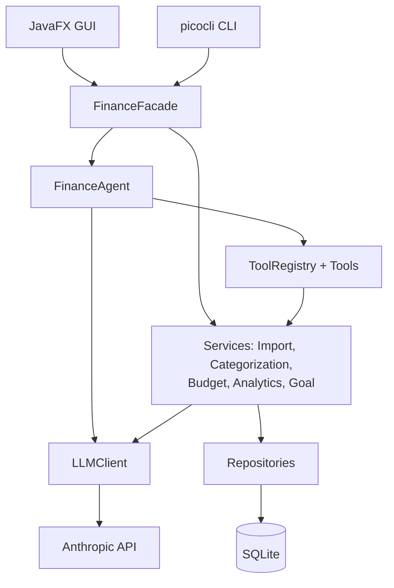

The GUI and CLI both go through one `FinanceFacade`, so every feature is implemented once and works from both interfaces.

### 1.8 User Interfaces

**GUI (JavaFX).** Four tabs plus a chat panel on the right side of every tab:

- **Dashboard:** this month's totals, budget alerts, and the monthly summary.
- **Transactions:** import CSV, view and edit categories.
- **Budgets & Goals:** budgets with progress bars, savings goals, and AI saving plans.
- **Insights:** trend charts, recurring payments, unusual expenses.

**CLI (picocli).** Every feature is also available from the terminal:

| Command | Features |
|---|---|
| `finagent import <file> --bank TD` | F01, F02 |
| `finagent categorize` / `finagent recategorize <id> <category> [--remember]` | F02, F03 |
| `finagent budget set <category> <amount> --month 2026-10` / `finagent budget status` | F04, F05 |
| `finagent trends --from 2026-05 --to 2026-10` | F06 |
| `finagent recurring` / `finagent unusual --month 2026-10` | F07, F08 |
| `finagent ask "<question>"` | F09 |
| `finagent summary --month 2026-10` | F10 |
| `finagent goal add ...` / `finagent goal plan <id>` | F11 |

### 1.9 Tech Stack

Java 21, JavaFX (GUI), picocli (CLI), SQLite with JDBC (storage), OpenCSV (CSV parsing), Anthropic Java SDK (LLM), Jackson (JSON), JUnit 5 (tests), Maven (build).

### 1.10 Scope

This is a solo project, so I kept the scope realistic: 11 features (one above the minimum), 4 GUI tabs instead of one screen per feature, and one agent loop that is reused by both agent features (F09 and F11). There are no external services other than the LLM. All data comes from local CSV files and SQLite.

---

## 2. Feature Specifications

| ID | Feature | Type |
|---|---|---|
| F01 | Import Transactions | Deterministic |
| F02 | AI Auto-Categorization | Hybrid |
| F03 | Category Correction and Learning | Hybrid |
| F04 | Budget Management | Deterministic |
| F05 | Budget Tracking and Alerts | Deterministic |
| F06 | Spending Trends and Charts | Deterministic |
| F07 | Recurring Payment Detection | Hybrid |
| F08 | Unusual Expense Detection | Hybrid |
| F09 | Ask FinAgent (Natural-Language Questions) | AI (agent) |
| F10 | Monthly Summary | Hybrid |
| F11 | Savings Goals and AI Saving Plan | Hybrid |

### F01: Import Transactions

- **Description:** Loads a bank CSV export into the app. Each bank uses different columns and date formats, so a `ColumnMapping` tells the importer which column is which. TD and RBC have built-in presets, and any other bank can be mapped by hand.
- **User interaction:** Transactions tab → Import CSV → pick a file → pick the bank (TD, RBC, or Custom, which opens a column-mapping dialog). CLI: `finagent import <file> --bank TD`.
- **Input:** CSV file and bank/column mapping.
- **Output:** Saved transactions, a refreshed table, and a summary (imported, duplicates skipped, bad rows).
- **AI involvement:** Deterministic. New transactions are then passed to F02.
- **Workflow:** Read rows → convert each row to a `Transaction` → skip duplicates (same date, amount, and description) → categorize (F02) → save → recheck budgets (F05).
- **Errors:** File can't be read: show an error. Columns don't match the chosen bank: ask the user to pick another bank or use Custom. Bad rows (invalid date or amount): skip them and list them in the summary.

### F02: AI Auto-Categorization

- **Description:** Gives each transaction a category (Groceries, Dining, Transport, etc.). Saved rules handle known merchants first, then the LLM categorizes the rest. Each transaction records where its category came from (rule, AI, or user) and a confidence score.
- **User interaction:** Runs automatically after import. An Auto-Categorize button re-runs it on uncategorized rows. Low-confidence results are highlighted for review. CLI: `finagent categorize`.
- **Input:** Uncategorized transactions, saved rules, the list of categories.
- **Output:** Updated transactions with category, source, and confidence.
- **AI involvement:** Hybrid (rules first, LLM for the rest).
- **Workflow:** Apply rules → send unmatched transactions to the LLM in batches, with the allowed categories and the user's rules as examples → read the JSON reply → apply results with confidence 0.6 or higher, flag the rest → save.
- **Errors:** No API key or no connection: use rules only and tell the user. Invalid reply or unknown category: leave those transactions uncategorized. Categories set by the user are never overwritten.

### F03: Category Correction and Learning

- **Description:** Lets the user fix a category. If they choose "remember," a rule is saved for that merchant, applied to matching transactions now, and used for future imports and as an example for the LLM.
- **User interaction:** Double-click a category cell → choose a category → optionally tick "Always use this for [merchant]". CLI: `finagent recategorize <id> <category> --remember`.
- **Input:** Transaction, new category, remember flag.
- **Output:** Updated transaction, optional new rule, refreshed budgets.
- **AI involvement:** Hybrid. The correction itself is deterministic, but saved rules are fed into the AI categorization prompt.
- **Workflow:** Update the transaction (source = user) → if remember, save a rule and apply it to other transactions from that merchant that weren't set by the user → recheck budgets.
- **Errors:** Transaction not found: show an error. A rule for that merchant already exists: ask before replacing it.

### F04: Budget Management

- **Description:** Create, edit, and delete monthly spending limits per category, and copy last month's budgets into a new month.
- **User interaction:** Budgets & Goals tab → choose month → add a budget (category + amount) → Save. CLI: `finagent budget set Dining 300 --month 2026-10`.
- **Input:** Month, category, amount.
- **Output:** Saved budget and updated budget list.
- **AI involvement:** Deterministic.
- **Workflow:** Validate → create or update the budget → recheck budgets (F05) → refresh.
- **Errors:** Amount is not a positive number: show a validation error. Budget already exists for that category and month: confirm before replacing.

### F05: Budget Tracking and Alerts

- **Description:** Shows how much of each budget has been used and raises an alert at 80% (warning) and 100% (exceeded). Alerts are sent to whichever interface is running (dashboard banner in the GUI, printed message in the CLI). Alert messages use fixed templates like "Dining budget at 85%", so no LLM is needed.
- **User interaction:** Progress bars on the Budgets & Goals tab and an alert banner on the Dashboard. CLI: `finagent budget status`, and alerts print during any command that triggers them.
- **Input:** Budgets and transactions for the month (runs automatically).
- **Output:** Budget status per category and alerts.
- **AI involvement:** Deterministic.
- **Workflow:** After any import, correction, or budget change, total the month's spending per category → compare to each limit → if a budget reaches a new level, notify all listeners.
- **Errors:** Category with spending but no budget: show "No budget set." Same level already alerted this month: don't alert again.

### F06: Spending Trends and Charts

- **Description:** Shows spending over a range of months: a pie chart by category, a bar chart per month, and a table with month-over-month change.
- **User interaction:** Insights tab → Trends → choose From and To months. CLI: `finagent trends --from 2026-05 --to 2026-10` prints a table.
- **Input:** Start and end month.
- **Output:** Charts (GUI) or a text table (CLI).
- **AI involvement:** Deterministic.
- **Workflow:** Load transactions in the range → total expenses by month and category → build a `TrendReport` → display it.
- **Errors:** Start month after end month: validation error. No data in the range: show an empty state.

### F07: Recurring Payment Detection

- **Description:** Finds charges that repeat on a regular schedule (weekly, monthly, yearly). The LLM then labels each one as a subscription or a regular bill and gives it a readable name. Shows the total monthly cost of subscriptions.
- **User interaction:** Insights tab → Recurring → Scan. CLI: `finagent recurring`.
- **Input:** The last 6 months of transactions.
- **Output:** List of recurring payments with name, amount, frequency, next expected date, and subscription flag.
- **AI involvement:** Hybrid (Java detects, LLM labels).
- **Workflow:** Group transactions by merchant → keep merchants with at least 3 charges at regular intervals and similar amounts → send them to the LLM for labels → display.
- **Errors:** Less than 3 months of data: warn that results may be incomplete. LLM unavailable: show the list without labels.

### F08: Unusual Expense Detection

- **Description:** Flags transactions that are much larger than usual for their category, and the LLM explains each one in plain language (for example, "This $640 at Best Buy is about 4 times your usual Shopping purchase").
- **User interaction:** Insights tab → Unusual Expenses → choose month → Scan. CLI: `finagent unusual --month 2026-10`.
- **Input:** Selected month, with the previous 3 months as a baseline.
- **Output:** List of flagged transactions with explanations.
- **AI involvement:** Hybrid (Java flags, LLM explains).
- **Workflow:** Work out the average for each category from the baseline months → flag transactions more than 3 times the category average, or over $200 at a new merchant → send flagged items to the LLM for explanations → display.
- **Errors:** Not enough history: only use the new-merchant rule. Nothing flagged: show "Nothing unusual this month." LLM unavailable: show the reason Java found (for example, "3.4x category average").

### F09: Ask FinAgent

- **Description:** The main agent feature. The user asks a question in plain English ("what were my 5 biggest purchases in September?", "am I on track with my budgets?") and the agent uses tools to get real numbers before answering. It remembers the conversation, so follow-ups like "what about August?" work.
- **User interaction:** Type in the chat panel. Each answer can be expanded to show which tools the agent used. CLI: `finagent ask "<question>"`.
- **Input:** Question and recent conversation history.
- **Output:** Answer text and the list of tools used.
- **AI involvement:** AI (agent with tool calling). Tools available: `QueryTransactionsTool`, `SpendingByCategoryTool`, `BudgetStatusTool`, `RecurringPaymentsTool`, `GoalsTool`.
- **Workflow:** Save the question to memory → send it to the LLM with the history and tool list → if the LLM asks for a tool, run it and send back the result → repeat until it answers or 6 steps are reached → show the answer.
- **Errors:** Question isn't about personal finance, or asks for investment advice: the agent declines politely. Tool fails: the error is sent back to the LLM so it can try again or explain. Step limit reached: return a partial answer. API unavailable: show an offline message.

### F10: Monthly Summary

- **Description:** A short recap of a month. Java calculates the numbers (income, spending, top categories, budget results), then the LLM writes a short summary with three saving tips based only on those numbers.
- **User interaction:** Dashboard → choose month → Generate Summary. CLI: `finagent summary --month 2026-10`.
- **Input:** Month.
- **Output:** Summary with stats and the written recap.
- **AI involvement:** Hybrid (Java stats, LLM writing).
- **Workflow:** Calculate the month's stats and budget results → send them to the LLM → show the stats with the recap.
- **Errors:** No transactions that month: show an error. LLM unavailable: show the stats only.

### F11: Savings Goals and AI Saving Plan

- **Description:** The user creates savings goals (name, target, deadline) and logs contributions. When asked, the agent looks at recent spending through its tools and suggests a plan: how much to save per month and which spending to cut.
- **User interaction:** Budgets & Goals tab → New Goal; Add Contribution; Get AI Plan. CLI: `finagent goal add "Trip" 2000 --deadline 2027-04-30`, `finagent goal plan <id>`.
- **Input:** Goal details, contribution amounts, goal ID for a plan.
- **Output:** Goal with progress bar, and a plan (monthly target, 3 to 5 suggestions, and whether it's realistic).
- **AI involvement:** Hybrid. Goal tracking is deterministic, and the plan uses the same agent loop as F09.
- **Workflow:** Save goal → on plan request, start the agent with a planning prompt → the LLM calls `SpendingByCategoryTool` and `RecurringPaymentsTool` → it returns a plan in JSON → display.
- **Errors:** Target not positive or deadline in the past: validation error. Goal already reached: no plan needed. LLM unavailable: show only the required amount per month.

---

## 3. Class Diagram

I split the class diagram into four views by layer so each one is readable. The class and method names are the same in every view, in the sequence diagrams, and in the traceability table.

### 3.1 Presentation and Facade

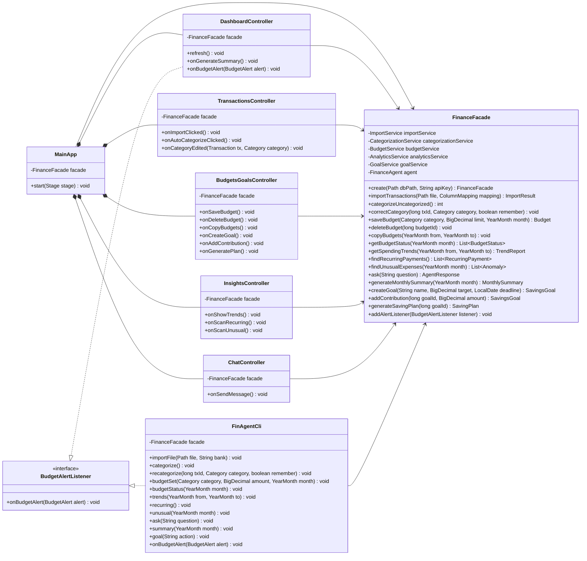

Notes: `FinanceFacade.create()` is a static method that builds the database, repositories, services, and agent, and wires them together. It picks the AI categorization strategy if an API key is given, otherwise rules only. Each GUI controller has a matching FXML view file (not drawn). Each `FinAgentCli` method is a picocli subcommand.

### 3.2 Services

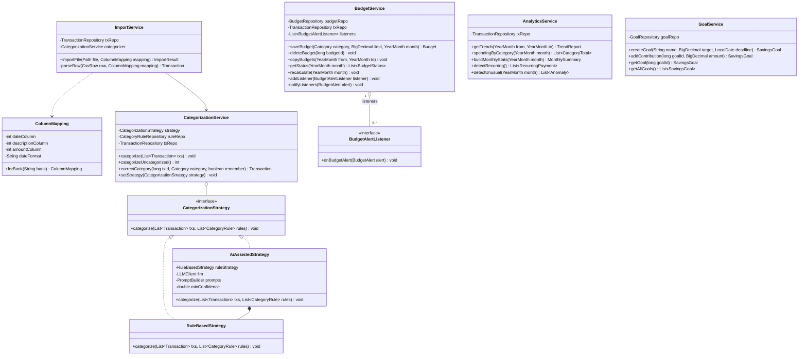

Notes: `ColumnMapping.forBank()` is static and returns the preset for TD or RBC. `AiAssistedStrategy` uses `LLMClient` and `PromptBuilder` from 3.3. All services use the repositories in 3.4.

### 3.3 Agent

```mermaid
classDiagram
    direction TB

    class FinanceAgent {
        -LLMClient llm
        -ToolRegistry tools
        -ConversationMemory memory
        -PromptBuilder prompts
        -int maxSteps
        +ask(String question) AgentResponse
        +labelSubscriptions(List~RecurringPayment~ items) void
        +explainAnomalies(List~Anomaly~ items) void
        +writeMonthlySummary(MonthlySummary summary) String
        +proposeSavingPlan(SavingsGoal goal) SavingPlan
        -runLoop(String systemPrompt, String userMessage) AgentResponse
    }
    class ConversationMemory {
        -List~ChatMessage~ messages
        -int maxMessages
        +add(ChatMessage message) void
        +recent() List~ChatMessage~
        +clear() void
    }
    class ChatMessage {
        -String role
        -String content
    }
    class PromptBuilder {
        +chatPrompt() String
        +categorizePrompt(List~Transaction~ txs, List~CategoryRule~ examples) String
        +subscriptionPrompt(List~RecurringPayment~ items) String
        +anomalyPrompt(List~Anomaly~ items) String
        +summaryPrompt(MonthlySummary summary) String
        +savingPlanPrompt(SavingsGoal goal) String
    }
    class LLMClient {
        <<interface>>
        +complete(String systemPrompt, List~ChatMessage~ messages, List~ToolSpec~ tools) LlmResponse
    }
    class ClaudeAdapter {
        -AnthropicClient sdk
        -String model
        +complete(String systemPrompt, List~ChatMessage~ messages, List~ToolSpec~ tools) LlmResponse
    }
    class MockLlmClient {
        -List~LlmResponse~ scripted
        +complete(String systemPrompt, List~ChatMessage~ messages, List~ToolSpec~ tools) LlmResponse
    }
    class AnthropicClient {
        <<external>>
        +messages() MessageService
    }
    class LlmResponse {
        -String text
        -List~ToolCall~ toolCalls
        +hasToolCalls() boolean
    }
    class ToolCall {
        -String id
        -String name
        -JsonNode arguments
    }
    class ToolSpec {
        -String name
        -String description
        -JsonNode inputSchema
    }
    class AgentResponse {
        -String answer
        -List~String~ toolsUsed
        -boolean complete
    }
    class ToolRegistry {
        -List~AgentTool~ tools
        +register(AgentTool tool) void
        +specs() List~ToolSpec~
        +execute(ToolCall call) String
    }
    class AgentTool {
        <<interface>>
        +spec() ToolSpec
        +execute(JsonNode args) String
    }
    class QueryTransactionsTool {
        -TransactionRepository txRepo
        +spec() ToolSpec
        +execute(JsonNode args) String
    }
    class SpendingByCategoryTool {
        -AnalyticsService analytics
        +spec() ToolSpec
        +execute(JsonNode args) String
    }
    class BudgetStatusTool {
        -BudgetService budgets
        +spec() ToolSpec
        +execute(JsonNode args) String
    }
    class RecurringPaymentsTool {
        -AnalyticsService analytics
        +spec() ToolSpec
        +execute(JsonNode args) String
    }
    class GoalsTool {
        -GoalService goals
        +spec() ToolSpec
        +execute(JsonNode args) String
    }

    FinanceAgent --> LLMClient
    FinanceAgent --> ToolRegistry
    FinanceAgent *-- ConversationMemory
    FinanceAgent *-- PromptBuilder
    FinanceAgent ..> AgentResponse : returns
    ConversationMemory o-- ChatMessage
    LLMClient <|.. ClaudeAdapter
    LLMClient <|.. MockLlmClient
    ClaudeAdapter --> AnthropicClient : adapts
    LLMClient ..> LlmResponse
    LlmResponse *-- ToolCall
    ToolRegistry "1" o-- "1..*" AgentTool
    AgentTool ..> ToolSpec
    AgentTool <|.. QueryTransactionsTool
    AgentTool <|.. SpendingByCategoryTool
    AgentTool <|.. BudgetStatusTool
    AgentTool <|.. RecurringPaymentsTool
    AgentTool <|.. GoalsTool
```

Notes: `SpendingByCategoryTool` accepts one or two months, so the agent can also use it to compare months. Tools return their results as JSON strings. If a tool fails, it returns a JSON error message that is sent back to the LLM.

### 3.4 Domain and Persistence

```mermaid
classDiagram
    direction TB

    class Transaction {
        -long id
        -LocalDate date
        -String description
        -String merchant
        -BigDecimal amount
        -Category category
        -CategorySource source
        -double confidence
        +isExpense() boolean
        +setCategory(Category category, CategorySource source, double confidence) void
    }
    class Category {
        <<enumeration>>
        GROCERIES
        DINING
        TRANSPORT
        RENT
        UTILITIES
        ENTERTAINMENT
        SHOPPING
        SUBSCRIPTIONS
        HEALTH
        INCOME
        OTHER
        UNCATEGORIZED
    }
    class CategorySource {
        <<enumeration>>
        RULE
        AI
        USER
        NONE
    }
    class CategoryRule {
        -long id
        -String merchant
        -Category category
        +matches(Transaction tx) boolean
    }
    class Budget {
        -long id
        -Category category
        -BigDecimal limit
        -YearMonth month
        -AlertLevel lastAlertLevel
    }
    class BudgetStatus {
        -Budget budget
        -BigDecimal spent
        +percentUsed() double
        +level() AlertLevel
    }
    class AlertLevel {
        <<enumeration>>
        OK
        WARNING
        EXCEEDED
    }
    class BudgetAlert {
        -Category category
        -YearMonth month
        -AlertLevel level
        -double percentUsed
        +message() String
    }
    class RecurringPayment {
        -String merchant
        -String displayName
        -BigDecimal amount
        -String frequency
        -LocalDate nextDate
        -boolean subscription
    }
    class Anomaly {
        -Transaction transaction
        -String reason
        -String explanation
    }
    class SavingsGoal {
        -long id
        -String name
        -BigDecimal target
        -BigDecimal saved
        -LocalDate deadline
        +progress() double
        +requiredPerMonth() BigDecimal
        +isComplete() boolean
    }
    class SavingPlan {
        -BigDecimal monthlyTarget
        -List~String~ suggestions
        -boolean realistic
    }
    class CategoryTotal {
        -YearMonth month
        -Category category
        -BigDecimal amount
    }
    class MonthlySummary {
        -YearMonth month
        -BigDecimal income
        -BigDecimal spent
        -List~CategoryTotal~ byCategory
        -List~BudgetStatus~ budgets
        -String recap
    }
    class TrendReport {
        -YearMonth from
        -YearMonth to
        -List~CategoryTotal~ totals
    }
    class ImportResult {
        -int imported
        -int duplicates
        -List~String~ badRows
        -Set~YearMonth~ months
    }
    class Database {
        -Connection connection
        +getConnection() Connection
    }
    class TransactionRepository {
        +saveAll(List~Transaction~ txs) void
        +update(Transaction tx) void
        +findById(long id) Transaction
        +findBetween(LocalDate from, LocalDate to) List~Transaction~
        +findUncategorized() List~Transaction~
        +findByMerchant(String merchant) List~Transaction~
        +exists(Transaction tx) boolean
    }
    class CategoryRuleRepository {
        +findAll() List~CategoryRule~
        +findByMerchant(String merchant) CategoryRule
        +save(CategoryRule rule) void
    }
    class BudgetRepository {
        +save(Budget budget) Budget
        +delete(long budgetId) void
        +findByMonth(YearMonth month) List~Budget~
    }
    class GoalRepository {
        +save(SavingsGoal goal) SavingsGoal
        +findById(long goalId) SavingsGoal
        +findAll() List~SavingsGoal~
    }

    Transaction --> Category
    Transaction --> CategorySource
    CategoryRule --> Category
    Budget --> Category
    Budget --> AlertLevel
    BudgetStatus --> Budget
    BudgetAlert --> AlertLevel
    Anomaly --> Transaction
    SavingPlan ..> SavingsGoal
    MonthlySummary *-- CategoryTotal
    MonthlySummary o-- BudgetStatus
    TrendReport *-- CategoryTotal
    TransactionRepository --> Database
    CategoryRuleRepository --> Database
    BudgetRepository --> Database
    GoalRepository --> Database
```

Note: `Budget.lastAlertLevel` stores the last alert sent for that budget, so the same alert isn't repeated.

---

## 4. Design Patterns

I use six patterns. Five are the core ones, and MVC is a sixth in case one is not accepted.

| Pattern | Where | Problem it solves |
|---|---|---|
| Facade | `FinanceFacade` | GUI and CLI need one simple way into the system |
| Strategy | `CategorizationStrategy` | Switch between rules-only and AI categorization |
| Observer | `BudgetService` and `BudgetAlertListener` | Notify the GUI or CLI when a budget crosses a threshold |
| Command | `AgentTool` and `ToolRegistry` | Let the LLM run operations by name |
| Adapter | `LLMClient` and `ClaudeAdapter` | Keep the Anthropic SDK out of the rest of the code |
| MVC | FXML views, controllers, and the model | Keep UI code separate from logic |

### 4.1 Facade

**Problem.** The app has five services and an agent, and some actions need more than one of them. For example, importing has to call `ImportService` and then `BudgetService.recalculate()`. The app also has two interfaces. Without one entry point, the GUI and CLI would both have to repeat this coordination.

**Classes.** `FinanceFacade` is the facade. The GUI controllers and `FinAgentCli` are the clients. `ImportService`, `CategorizationService`, `BudgetService`, `AnalyticsService`, `GoalService`, and `FinanceAgent` are the subsystem.

**Why it fits.** Each feature is written once behind the facade. The GUI and CLI only collect input, call one facade method, and show the result, which is what makes having two interfaces cheap.

**Without it.** Each controller and CLI command would need references to several services and would repeat the same steps, and the GUI and CLI could end up behaving differently.

### 4.2 Strategy

**Problem.** Categorization has to work with an API key (rules plus AI) and without one (rules only). It should also be able to switch to rules only if the API stops working during a session.

**Classes.** `CategorizationService` is the context and holds the current strategy. `CategorizationStrategy` is the strategy interface. `RuleBasedStrategy` and `AiAssistedStrategy` are the concrete strategies.

**Why it fits.** The two approaches take the same input and produce the same result, and the choice depends on runtime conditions. Switching is one call: `setStrategy(new RuleBasedStrategy())`.

**Without it.** `CategorizationService` would be full of if/else checks mixing rule matching and LLM code, and adding another approach would mean editing that class.

### 4.3 Observer

**Problem.** When spending crosses a budget threshold, the running interface needs to know: the GUI shows a banner and the CLI prints a message. This can happen during an import, a category correction, or a budget change. `BudgetService` shouldn't know which interface is running.

**Classes.** `BudgetService` is the subject (`addListener()`, `notifyListeners()`). `BudgetAlertListener` is the observer interface. `DashboardController` and `FinAgentCli` are the concrete observers. `BudgetAlert` is the data passed to them.

**Why it fits.** It's a one-to-many relationship where the listeners depend on how the app was started, and the subject shouldn't depend on them.

**Without it.** `BudgetService` would need direct references to GUI and CLI classes, which would make the service layer depend on the UI.

### 4.4 Command

**Problem.** The LLM decides at runtime which operation to run, by sending back a tool name and arguments. The agent has to run it without a big switch statement over every tool, and each tool has to describe itself so the LLM knows it exists.

**Classes.** `AgentTool` is the command interface (`execute()`, `spec()`). The five tools are the concrete commands. `ToolRegistry` is the invoker. `FinanceAgent` is the client. The services and `TransactionRepository` are the receivers that do the real work.

**Why it fits.** Each tool call is a request (a name plus arguments) that gets executed by an invoker that doesn't know the details. `ToolRegistry.execute()` is also the one place to catch errors and record which tools were used.

**Without it.** `FinanceAgent` would have a growing switch statement with argument parsing for every tool, and every new tool would mean changing the agent loop.

### 4.5 Adapter

**Problem.** The Anthropic SDK has its own request and response classes and its own tool-call format. If the agent used them directly, the whole agent would depend on that SDK, and tests would need network calls.

**Classes.** `LLMClient` is the target interface. `ClaudeAdapter` is the adapter. `AnthropicClient` (from the SDK) is the adaptee. `FinanceAgent` and `AiAssistedStrategy` are the clients. `MockLlmClient` is a second implementation used for tests.

**Why it fits.** The SDK is a third-party interface I can't change, and it doesn't match what my code needs.

**Without it.** SDK classes would appear throughout the agent and strategy code, changing providers would mean rewriting them, and tests would need an API key.

### 4.6 MVC

**Problem.** Mixing JavaFX layout code with finance logic would make the logic hard to test and impossible to reuse in the CLI.

**Classes.** The model is the domain classes and services (reached through `FinanceFacade`). The views are the FXML files. The controllers are `DashboardController`, `TransactionsController`, `BudgetsGoalsController`, `InsightsController`, and `ChatController`.

**Why it fits.** JavaFX is built around FXML views with controller classes, and since the model doesn't depend on JavaFX, the CLI can use the same model.

**Without it.** Business logic would end up inside button handlers, where it can't be tested or reused by the CLI.

---

## 5. Use-Case Diagram

Actors:

- **User** (primary): uses the app through the GUI or CLI.
- **LLM Service** (secondary): the Anthropic API.
- **File System** (secondary): where the CSV files come from.

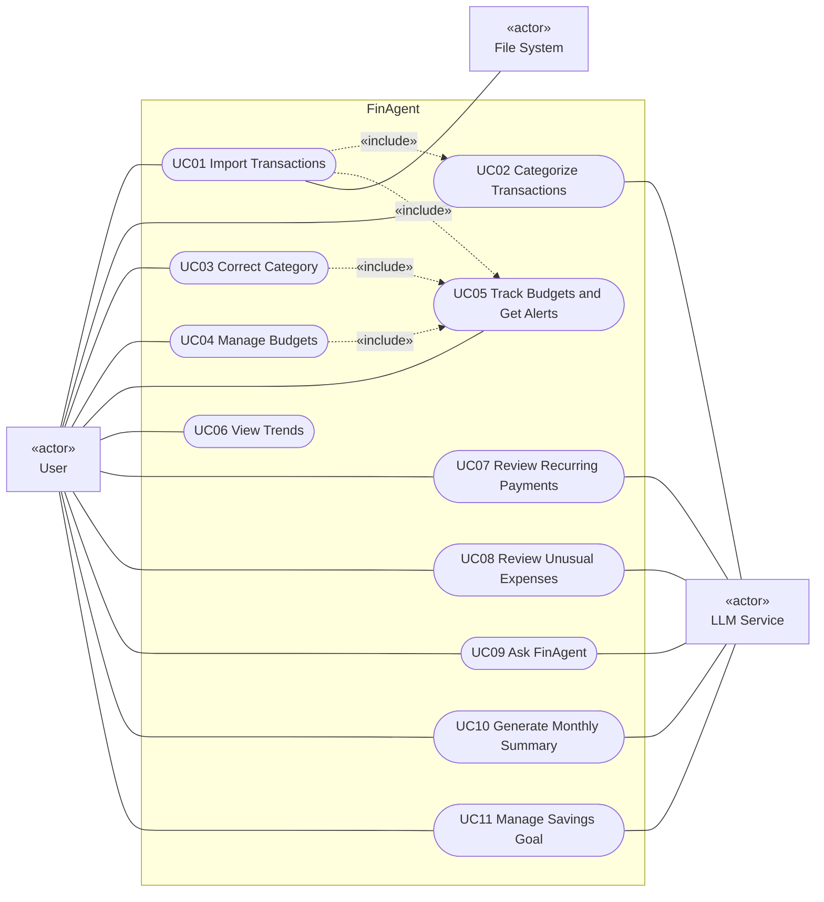

Every import includes categorization (UC02). Imports, corrections, and budget changes all include a budget check (UC05). Saving a merchant rule is part of UC03, since it only happens when the user corrects a category.

---

## 6. Use-Case Descriptions

### UC01: Import Transactions

| | |
|---|---|
| **Actors** | User (primary), File System |
| **Goal** | Load a bank CSV into the app. |
| **Preconditions** | The app is running and the user has a CSV export. |
| **Trigger** | User clicks Import CSV or runs `finagent import`. |
| **Main scenario** | 1. User picks a file and bank. 2. System reads and converts each row. 3. System skips duplicates. 4. System categorizes the new transactions (UC02). 5. System saves them. 6. System rechecks budgets (UC05). 7. System shows the import summary. |
| **Alternatives** | 2a. File unreadable or columns don't match: show an error and let the user pick again. 2b. Some rows invalid: skip and list them. 3a. All rows are duplicates: show "No new transactions." |
| **Postconditions** | New transactions are saved and categorized where possible. |
| **Features** | F01, F02, F05 |

### UC02: Categorize Transactions

| | |
|---|---|
| **Actors** | User (primary), LLM Service |
| **Goal** | Give every transaction a category. |
| **Preconditions** | There are uncategorized transactions. |
| **Trigger** | Part of UC01, or user clicks Auto-Categorize / runs `finagent categorize`. |
| **Main scenario** | 1. System applies saved rules. 2. System sends the rest to the LLM with the category list and rules as examples. 3. LLM returns a category and confidence for each. 4. System applies results with confidence of at least 0.6 and flags the rest. 5. System saves and refreshes the table. |
| **Alternatives** | 2a. No API key or no connection: rules only, and the user is told. 3a. Invalid reply: leave those uncategorized. |
| **Postconditions** | Transactions have a category, source, and confidence. |
| **Features** | F02 |

### UC03: Correct Category

| | |
|---|---|
| **Actors** | User |
| **Goal** | Fix a category and optionally make the system remember it. |
| **Preconditions** | The transaction exists. |
| **Trigger** | User edits a category cell or runs `finagent recategorize`. |
| **Main scenario** | 1. User picks a new category and optionally ticks "remember." 2. System updates the transaction. 3. If remember, system saves a merchant rule and applies it to matching transactions. 4. System rechecks budgets (UC05). |
| **Alternatives** | 1a. User cancels: nothing changes. 3a. A rule already exists: ask before replacing it. |
| **Postconditions** | Transaction is corrected, and a rule may be saved. |
| **Features** | F03, F05 |

### UC04: Manage Budgets

| | |
|---|---|
| **Actors** | User |
| **Goal** | Set monthly limits per category. |
| **Preconditions** | None. |
| **Trigger** | User uses the Budgets & Goals tab or runs `finagent budget set`. |
| **Main scenario** | 1. User picks a month, category, and amount. 2. System validates it. 3. System saves the budget. 4. System rechecks budgets (UC05). 5. System shows the updated list. |
| **Alternatives** | 2a. Invalid amount: show an error. 3a. Budget already exists: confirm replacement. 1a. User copies last month's budgets instead. |
| **Postconditions** | Budgets are saved. |
| **Features** | F04, F05 |

### UC05: Track Budgets and Get Alerts

| | |
|---|---|
| **Actors** | User |
| **Goal** | See budget progress and get warned about overspending. |
| **Preconditions** | At least one budget exists for the month. |
| **Trigger** | Part of UC01, UC03, or UC04, or the user opens the budgets view / runs `finagent budget status`. |
| **Main scenario** | 1. System totals spending per budgeted category. 2. System calculates the percentage used. 3. If a budget reaches a new level (80% or 100%), system notifies the listeners. 4. GUI shows a banner, or CLI prints a message. |
| **Alternatives** | 3a. Level already alerted: no repeat. 1a. No budgets: show "No budgets set." |
| **Postconditions** | Budget status is up to date. |
| **Features** | F05 |

### UC06: View Trends

| | |
|---|---|
| **Actors** | User |
| **Goal** | See how spending changes over time. |
| **Preconditions** | Transactions exist. |
| **Trigger** | Insights tab → Trends, or `finagent trends`. |
| **Main scenario** | 1. User picks a month range. 2. System totals spending by month and category. 3. System shows charts and a comparison table. |
| **Alternatives** | 1a. Invalid range: show an error. 2a. No data: show an empty state. |
| **Postconditions** | None. |
| **Features** | F06 |

### UC07: Review Recurring Payments

| | |
|---|---|
| **Actors** | User, LLM Service |
| **Goal** | Find recurring charges and subscriptions. |
| **Preconditions** | Ideally at least 3 months of data. |
| **Trigger** | Insights tab → Recurring → Scan, or `finagent recurring`. |
| **Main scenario** | 1. System finds regular repeating charges. 2. System sends them to the LLM. 3. LLM returns a name and subscription label for each. 4. System shows the list and subscription total. |
| **Alternatives** | 1a. Less than 3 months of data: show a warning. 1b. None found: show a message. 3a. LLM unavailable: show the list without labels. |
| **Postconditions** | None. |
| **Features** | F07 |

### UC08: Review Unusual Expenses

| | |
|---|---|
| **Actors** | User, LLM Service |
| **Goal** | Find and understand unusual charges in a month. |
| **Preconditions** | Transactions exist for that month. |
| **Trigger** | Insights tab → Unusual Expenses → Scan, or `finagent unusual`. |
| **Main scenario** | 1. User picks a month. 2. System compares each charge to the category average from the previous 3 months and flags outliers. 3. System sends the flagged charges to the LLM. 4. LLM returns an explanation for each. 5. System shows the list. |
| **Alternatives** | 2a. Not enough history: new-merchant rule only. 2b. Nothing flagged: show a message. 4a. LLM unavailable: show the reason Java found. |
| **Postconditions** | None. |
| **Features** | F08 |

### UC09: Ask FinAgent

| | |
|---|---|
| **Actors** | User, LLM Service |
| **Goal** | Get an answer to a question about personal finances, based on real data. |
| **Preconditions** | API key configured, transactions exist. |
| **Trigger** | User sends a chat message or runs `finagent ask`. |
| **Main scenario** | 1. User asks a question. 2. System sends it to the LLM with the conversation history and tool list. 3. LLM asks for a tool. 4. System runs the tool and returns the result. 5. Steps 3 and 4 repeat until the LLM answers. 6. System shows the answer and the tools used. |
| **Alternatives** | 3a. Off-topic or investment-advice question: the agent declines. 4a. Tool error: sent back to the LLM. 5a. Step limit reached: partial answer. 2a. API unavailable: offline message. |
| **Postconditions** | Question and answer are saved in conversation memory. |
| **Features** | F09 |

### UC10: Generate Monthly Summary

| | |
|---|---|
| **Actors** | User, LLM Service |
| **Goal** | Get a short recap of a month with saving tips. |
| **Preconditions** | Transactions exist for that month. |
| **Trigger** | Dashboard → Generate Summary, or `finagent summary`. |
| **Main scenario** | 1. User picks a month. 2. System calculates the stats and budget results. 3. System sends them to the LLM. 4. LLM writes the recap. 5. System shows it. |
| **Alternatives** | 2a. No transactions: show an error. 4a. LLM unavailable: show stats only. |
| **Postconditions** | None. |
| **Features** | F10 |

### UC11: Manage Savings Goal

| | |
|---|---|
| **Actors** | User, LLM Service |
| **Goal** | Track a savings goal and get a plan to reach it. |
| **Preconditions** | None to create a goal. A plan needs spending history. |
| **Trigger** | Budgets & Goals tab, or `finagent goal`. |
| **Main scenario** | 1. User creates a goal. 2. System saves it. 3. User logs contributions. 4. User asks for a plan. 5. Agent calls spending and recurring-payment tools. 6. LLM returns a plan. 7. System shows it. |
| **Alternatives** | 2a. Invalid target or deadline: show an error. 4a. Goal already reached: no plan needed. 6a. LLM unavailable: show the required amount per month only. |
| **Postconditions** | Goal and progress are saved. |
| **Features** | F11 |

---

## 7. Sequence Diagrams

Six diagrams cover all 11 features. Every feature can be started from the GUI or the CLI, and both call the same `FinanceFacade` method, so most diagrams show the GUI path only. SD05 shows both entry points as an example.

| SD | Title | Features |
|---|---|---|
| SD01 | Import and Categorize | F01, F02, F05 |
| SD02 | Correct a Category | F03, F05 |
| SD03 | Save a Budget and Get an Alert | F04, F05 |
| SD04 | Insights: Trends, Recurring, Unusual | F06, F07, F08 |
| SD05 | Ask FinAgent | F09 |
| SD06 | Monthly Summary and Saving Plan | F10, F11 |

### SD01: Import and Categorize (F01, F02, F05)

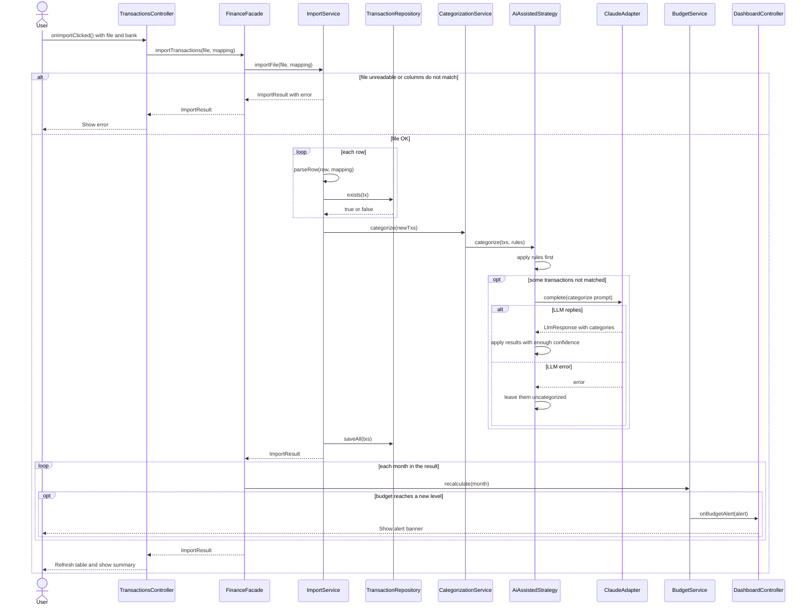

### SD02: Correct a Category (F03, F05)

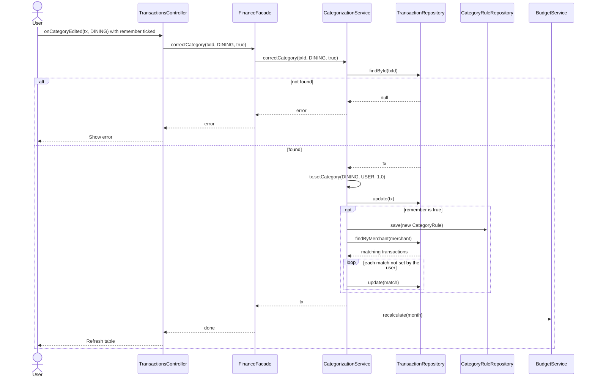

If a rule already exists for that merchant, the controller asks the user before replacing it.

### SD03: Save a Budget and Get an Alert (F04, F05)

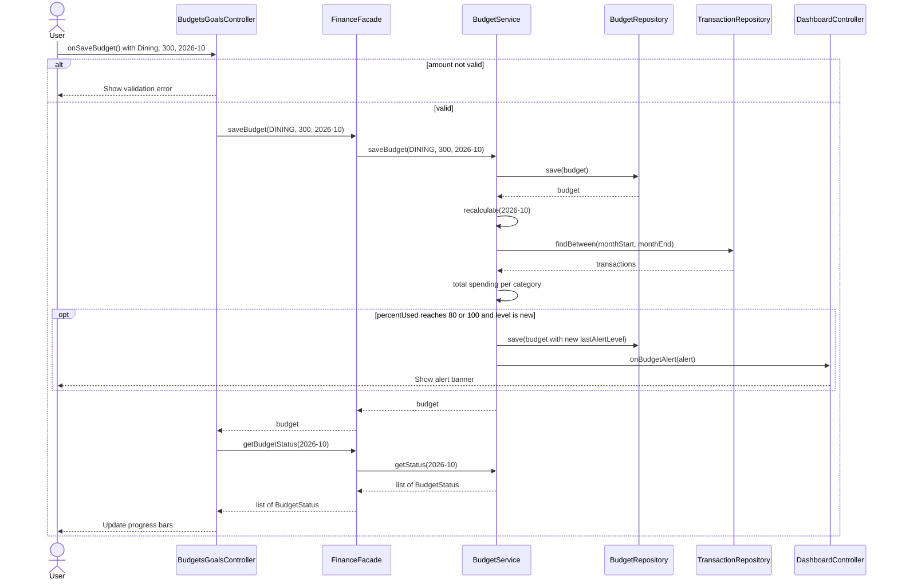

### SD04: Insights: Trends, Recurring, Unusual (F06, F07, F08)

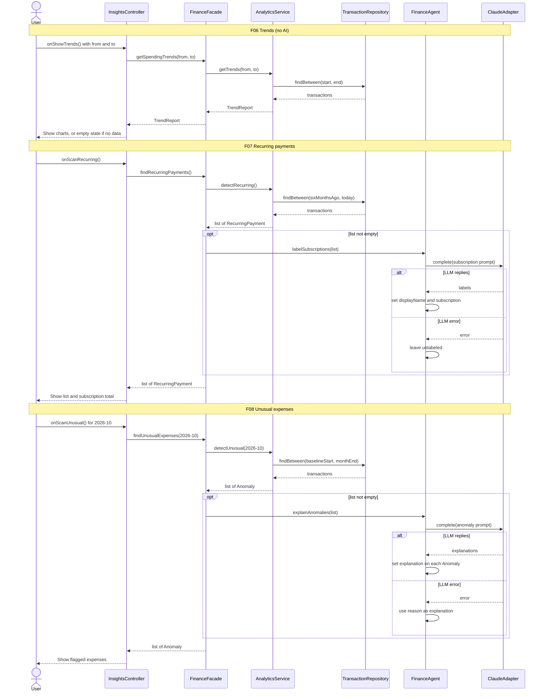

### SD05: Ask FinAgent (F09)

This is the main agent loop. The LLM picks tools by name, `ToolRegistry` runs them, and the results go back to the LLM until it answers.

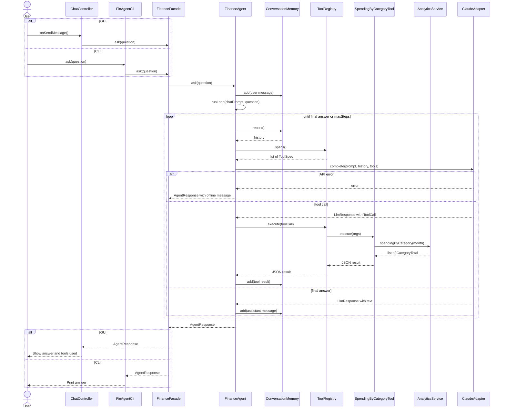

If the LLM asks for a tool that doesn't exist or sends bad arguments, `ToolRegistry` returns a JSON error instead of failing, and the LLM can try again. If `maxSteps` is reached, the response is marked incomplete.

### SD06: Monthly Summary and Saving Plan (F10, F11)

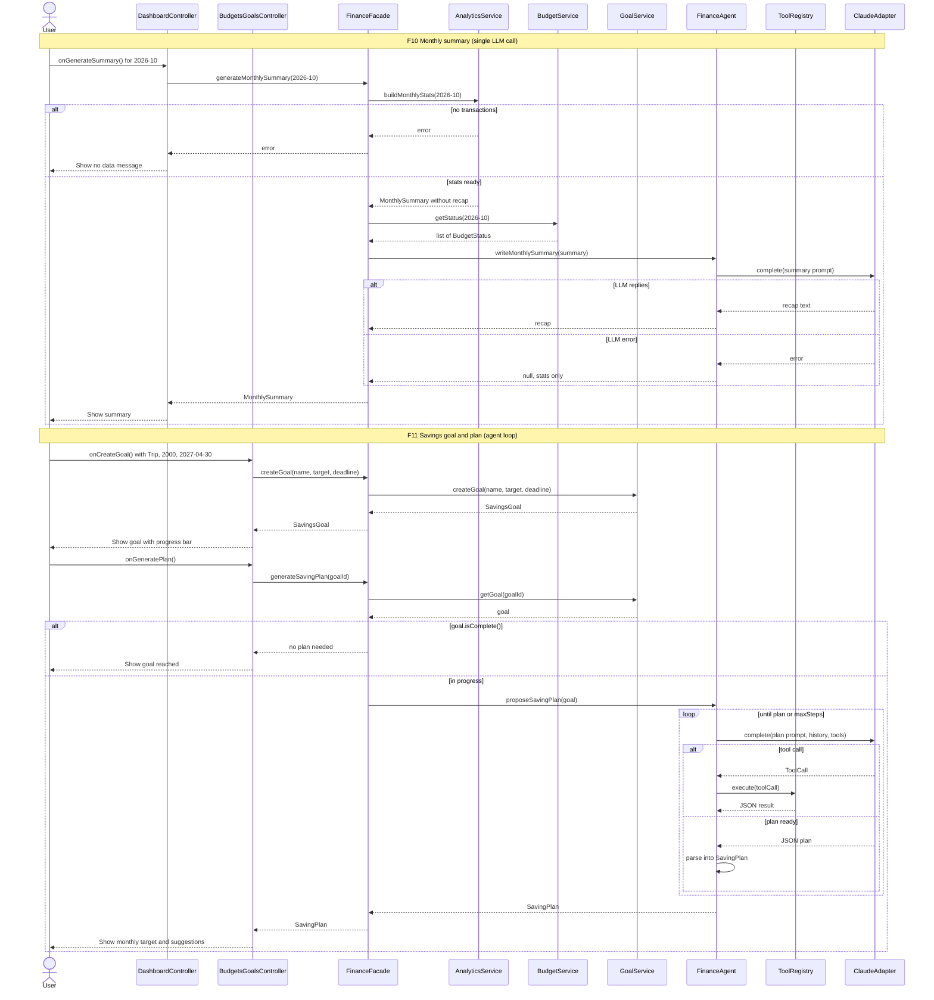

In F11, the LLM usually calls `SpendingByCategoryTool` (last 3 months) and `RecurringPaymentsTool`. If the LLM fails, the facade returns a plan with only `goal.requiredPerMonth()`.

---

## 8. Feature-to-Design Traceability

| Feature | Description | Type | Use Case | Classes | Key Methods | SD | Patterns |
|---|---|---|---|---|---|---|---|
| F01 | Import bank CSV | Deterministic | UC01 | TransactionsController, FinAgentCli, FinanceFacade, ImportService, ColumnMapping, TransactionRepository | `importTransactions()`, `importFile()`, `parseRow()`, `exists()`, `saveAll()` | SD01 | Facade, MVC |
| F02 | AI categorization | Hybrid | UC02 | CategorizationService, CategorizationStrategy, RuleBasedStrategy, AiAssistedStrategy, PromptBuilder, LLMClient, ClaudeAdapter | `categorize()`, `categorizeUncategorized()`, `categorizePrompt()`, `complete()` | SD01 | Strategy, Adapter |
| F03 | Correct category, learn rule | Hybrid | UC03 | TransactionsController, FinanceFacade, CategorizationService, CategoryRuleRepository, TransactionRepository, BudgetService | `onCategoryEdited()`, `correctCategory()`, `setCategory()`, `save()`, `recalculate()` | SD02 | Facade, Observer |
| F04 | Manage budgets | Deterministic | UC04 | BudgetsGoalsController, FinanceFacade, BudgetService, BudgetRepository | `onSaveBudget()`, `saveBudget()`, `deleteBudget()`, `copyBudgets()` | SD03 | Facade, MVC |
| F05 | Budget tracking and alerts | Deterministic | UC05 | BudgetService, BudgetStatus, BudgetAlert, BudgetAlertListener, DashboardController, FinAgentCli | `recalculate()`, `getStatus()`, `notifyListeners()`, `onBudgetAlert()` | SD01, SD03 | Observer |
| F06 | Spending trends | Deterministic | UC06 | InsightsController, FinanceFacade, AnalyticsService, TrendReport | `onShowTrends()`, `getSpendingTrends()`, `getTrends()`, `findBetween()` | SD04 | Facade, MVC |
| F07 | Recurring payments | Hybrid | UC07 | InsightsController, FinanceFacade, AnalyticsService, FinanceAgent, ClaudeAdapter | `findRecurringPayments()`, `detectRecurring()`, `labelSubscriptions()` | SD04 | Facade, Adapter |
| F08 | Unusual expenses | Hybrid | UC08 | InsightsController, FinanceFacade, AnalyticsService, FinanceAgent, ClaudeAdapter | `findUnusualExpenses()`, `detectUnusual()`, `explainAnomalies()` | SD04 | Facade, Adapter |
| F09 | Ask FinAgent | AI (agent) | UC09 | ChatController, FinAgentCli, FinanceFacade, FinanceAgent, ConversationMemory, ToolRegistry, AgentTool and the 5 tools, ClaudeAdapter | `ask()`, `runLoop()`, `specs()`, `execute()`, `complete()` | SD05 | Command, Adapter, Facade |
| F10 | Monthly summary | Hybrid | UC10 | DashboardController, FinanceFacade, AnalyticsService, BudgetService, FinanceAgent, PromptBuilder | `generateMonthlySummary()`, `buildMonthlyStats()`, `writeMonthlySummary()` | SD06 | Facade, Adapter |
| F11 | Savings goals and plan | Hybrid | UC11 | BudgetsGoalsController, FinanceFacade, GoalService, GoalRepository, FinanceAgent, ToolRegistry, SpendingByCategoryTool, RecurringPaymentsTool | `createGoal()`, `addContribution()`, `generateSavingPlan()`, `proposeSavingPlan()`, `runLoop()` | SD06 | Command, Adapter, Facade |

---

## 9. How Each Feature Is Implemented

**F01: Import Transactions** (UC01, SD01). `TransactionsController.onImportClicked()` gets the file and bank, then calls `FinanceFacade.importTransactions()` with a `ColumnMapping` from `ColumnMapping.forBank()`. `ImportService.importFile()` reads the CSV, converts each row with `parseRow()`, and skips rows where `TransactionRepository.exists()` is true. It sends new transactions to `CategorizationService.categorize()` (F02) and saves them with `saveAll()`. The facade then calls `BudgetService.recalculate()` for each month in the `ImportResult` (F05).

**F02: AI Auto-Categorization** (UC02, SD01). `CategorizationService.categorize()` loads the rules and passes them to the current `CategorizationStrategy`. With an API key, this is `AiAssistedStrategy`: it runs `RuleBasedStrategy` first, then builds a prompt with `PromptBuilder.categorizePrompt()` for the rest and calls `LLMClient.complete()`. Results under `minConfidence` stay uncategorized. If there's no key, or the API fails, `setStrategy(new RuleBasedStrategy())` switches to rules only.

**F03: Category Correction and Learning** (UC03, SD02). `TransactionsController.onCategoryEdited()` calls `FinanceFacade.correctCategory()`. `CategorizationService.correctCategory()` loads the transaction, calls `setCategory()` with source `USER`, and saves it. If remember is set, it saves a `CategoryRule` and updates other transactions from the same merchant that weren't set by the user. The facade then calls `BudgetService.recalculate()`. Saved rules are used by `RuleBasedStrategy` and included as examples in `categorizePrompt()`.

**F04: Budget Management** (UC04, SD03). `BudgetsGoalsController.onSaveBudget()` validates the input and calls `FinanceFacade.saveBudget()`. `BudgetService.saveBudget()` saves through `BudgetRepository` and calls `recalculate()`. `copyBudgets()` reads the previous month's budgets with `findByMonth()` and saves copies for the new month.

**F05: Budget Tracking and Alerts** (UC05, SD01, SD03). At startup, `MainApp` registers `DashboardController` and the CLI registers `FinAgentCli` as listeners through `addAlertListener()`. `BudgetService.recalculate()` totals the month's spending, builds a `BudgetStatus` for each budget, and compares `level()` with `Budget.lastAlertLevel`. When a budget reaches a new level, it saves the new level and calls `notifyListeners()`, which calls `onBudgetAlert()` on each listener.

**F06: Spending Trends** (UC06, SD04). `InsightsController.onShowTrends()` calls `FinanceFacade.getSpendingTrends()`. `AnalyticsService.getTrends()` loads transactions with `findBetween()`, totals expenses by month and category into `CategoryTotal` objects, and returns a `TrendReport`. The controller shows it as JavaFX charts, and the CLI prints it as a table.

**F07: Recurring Payment Detection** (UC07, SD04). `AnalyticsService.detectRecurring()` groups six months of transactions by merchant and keeps the ones that repeat regularly with similar amounts. The facade passes them to `FinanceAgent.labelSubscriptions()`, which builds a prompt with `subscriptionPrompt()`, calls `complete()`, and sets `displayName` and `subscription` on each item. If the LLM fails, the list is returned unlabeled.

**F08: Unusual Expense Detection** (UC08, SD04). `AnalyticsService.detectUnusual()` works out each category's average from the previous three months and creates an `Anomaly` for each outlier, with a `reason`. The facade passes them to `FinanceAgent.explainAnomalies()`, which fills in each `explanation` from the LLM. If the LLM fails, the `reason` is used instead.

**F09: Ask FinAgent** (UC09, SD05). `ChatController.onSendMessage()` (or `FinAgentCli.ask()`) calls `FinanceFacade.ask()`. `FinanceAgent.ask()` saves the question in `ConversationMemory` and starts `runLoop()`. Each step sends the prompt, `memory.recent()`, and `ToolRegistry.specs()` to `LLMClient.complete()`. If the response has tool calls, `ToolRegistry.execute()` runs the matching `AgentTool`. For example, `SpendingByCategoryTool` calls `AnalyticsService.spendingByCategory()`. The JSON result is added to memory and the loop continues. When the LLM replies with text, the loop ends and an `AgentResponse` is returned with the answer and the tools used.

**F10: Monthly Summary** (UC10, SD06). `DashboardController.onGenerateSummary()` calls `FinanceFacade.generateMonthlySummary()`. The facade gets a `MonthlySummary` with the numbers from `AnalyticsService.buildMonthlyStats()`, adds budget results from `BudgetService.getStatus()`, and calls `FinanceAgent.writeMonthlySummary()`. That method sends only those numbers to the LLM using `summaryPrompt()` and returns the recap text. If the LLM fails, the summary is shown without the recap.

**F11: Savings Goals and AI Plan** (UC11, SD06). `GoalService.createGoal()` and `addContribution()` save goals through `GoalRepository`. For a plan, `FinanceFacade.generateSavingPlan()` loads the goal and calls `FinanceAgent.proposeSavingPlan()`. This uses the same `runLoop()` as F09, with `savingPlanPrompt()`. The LLM calls `SpendingByCategoryTool` and `RecurringPaymentsTool` through `ToolRegistry`, then returns a JSON plan that is turned into a `SavingPlan`. If that fails, the plan only contains `goal.requiredPerMonth()`.

---

## 10. Stage 2 Plan

I'll build from the bottom up, testing each layer before moving on:

1. Database and repositories, tested with an in-memory SQLite database.
2. The deterministic services (import, budgets, analytics, goals), tested without any LLM.
3. `LLMClient`, `MockLlmClient`, `ClaudeAdapter`, `PromptBuilder`, and the two categorization strategies.
4. The tools, `ToolRegistry`, `ConversationMemory`, and `FinanceAgent.runLoop()`, tested with scripted mock responses.
5. `FinanceFacade`, then the CLI (faster to build, so every feature can be demoed early), then the JavaFX GUI.
6. A few end-to-end tests with the real API.

If time runs short, the agent loop (F09) and the core features (F01, F02, F04, F05) come first, since they cover the AI and design pattern requirements.
